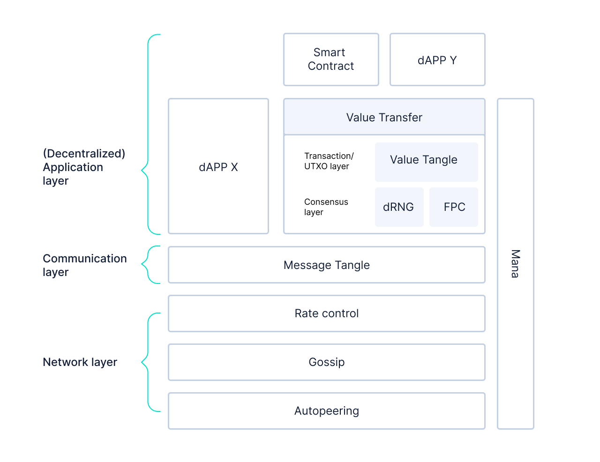

<h1 align="center">
   
  
</h1>

<h2 align="center">Prototype node software for an IOTA network without the Coordinator</h2>

    <a href="https://github.com/iotaledger/goshimmer/wiki" style="text-decoration:none;">
    

  
    
    
    
    
    

      

  <a href="#about">About</a> ◈
  <a href="#design">Design</a> ◈
  <a href="#implemented-coordicide-modules">Implemented Coordicide modules</a> ◈
  <a href="#work-in-progress-modules">Work-in-progress modules</a> ◈
  <a href="#getting-started">Getting started</a> ◈
  <a href="#client-library-and-http-api-reference">Client-Library and HTTP API reference</a> ◈
  <a href="#supporting-the-project">Supporting the project</a> ◈
  <a href="#joining-the-discussion">Joining the discussion</a> 

---

## About

This repository is where the IOTA Foundation's Research Department tests the Coordicide modules to study and evaluate their performance.

The aim of this open repository is  to give the community the opportunity to follow developments, take part in testing, and learn  more about [Coordicide](https://coordicide.iota.org/).

**Note:** You can find details about future development plans on our [roadmap](https://roadmap.iota.org).

## Design
The code in GoShimmer is modular, where each module represents either one of the [Coordicide components](https://coordicide.iota.org/) or a basic node function such as the gossip, ledger state, API just to mention a few.  

GoShimmer modularity is based on a combination of event-driven and layer-based approaches.

Each module is defined in the `packages` directory, with the exceptions for the dApps (e.g., value transfer, network delay and the faucet) that are under the `dapps` folder. Each module can be enabled using the `plugins` directory.

**Note:** See the `main.go` file to see which plugins are currently supported.

## Implemented Coordicide modules

The `master` branch is the stable version of the GoShimmer software, which includes a minimal set of modules to allow you to send and gossip the following types of object:

- Generic data object, and more in general, any non-value transfer can be supported with its own dApp/App. 
- Value objects to issue transactions. 
- Faucet funding request objects.

The `master` branch includes the following Coordicide modules: 

- [Node identities](https://coordicide.iota.org/module1)

- [Autopeering](https://coordicide.iota.org/module2). We also have a standalone autopeering simulator in this [repository](https://github.com/iotaledger/autopeering-sim).

- [Fast Probabilistic Consensus](https://coordicide.iota.org//module4.1.2).  We also have a standalone FPC simulator in this [repository](https://github.com/iotaledger/fpc-sim).

- [Tip Selection Algorithm](https://coordicide.iota.org//module5)

- [Parallel-reality-based Ledger State](https://iota.cafe/t/parallel-reality-based-ledger-state-using-utxo/261) (using the UTXO model).

## Work-in-progress modules

Work-in-progress modules are typically kept on a different branch such as `mana`, and are not compatible with the `master` branch. Therefore, nodes that run these branches cannot join the current network because the code either is still too experimental or it includes breaking changes. The same goes for the `develop` branch.

The following Coordicide modules are a work in progress: 

- [Mana](https://coordicide.iota.org/module1): The `mana` branch contains a first implementation of the mana module in the `packages` directory.

- [Cellular Consensus](https://coordicide.iota.org/module5.1.1): The `ca` branch contains a first implementation of the Cellular Consensus module in the `packages` directory.

- [Spam Protection](https://coordicide.iota.org/module3): You can find the initial simulation source code of the rate control in this [repository](https://github.com/andypandypi/IOTARateControl) and the source code of the Adaptive Proof of Work simulator [here](https://github.com/iotaledger/adaptive-pow-sim).

## Client-Library and HTTP API reference

You can use the Go client-library to interact with GoShimmer (located under `github.com/iotaledger/goshimmer/client`).

You can find more info about this on our [client-lib](https://github.com/iotaledger/goshimmer/wiki/Client-Lib:-Interaction-with-layers) wiki page.

## Getting started

You can find tutorials on how to [setup a GoShimmer node](https://github.com/iotaledger/goshimmer/wiki/Setup-up-a-GoShimmer-node-(Joining-the-pollen-testnet)), [writing a dApp](https://github.com/iotaledger/goshimmer/wiki/How-to-create-a-simple-dApp), [obtaining tokens from the faucet](https://github.com/iotaledger/goshimmer/wiki/How-to-obtain-tokens-from-the-faucet) and more on our [wiki](https://github.com/iotaledger/goshimmer/wiki).

## Supporting the project

If you want to contribute to the code, consider posting a [bug report](https://github.com/iotaledger/goshimmer/issues/new-issue), feature request or a [pull request](https://github.com/iotaledger/goshimmer/pulls/).

When creating a pull request, we recommend that you do the following:

1. Clone the repository
2. Create a new branch for your fix or feature. For example, `git checkout -b fix/my-fix` or ` git checkout -b feat/my-feature`.
3. Run the `go fmt` command to make sure your code is well formatted
4. Document any exported packages
5. Target your pull request to be merged with `dev`

## Joining the discussion

If you want to get involved in the community, need help getting started, have any issues related to the repository or just want to discuss blockchain, distributed ledgers, and IoT with other people, feel free to join our [Discord](https://discord.iota.org/).