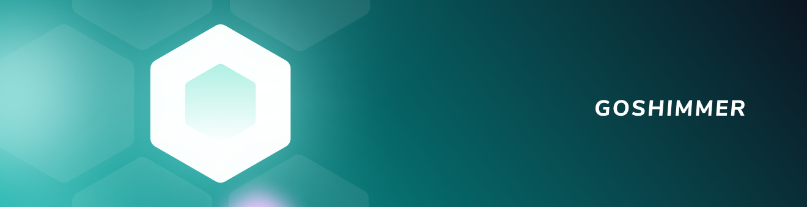

<h1 align="center">
  <br>
  <a href="https://wiki.iota.org/goshimmer/welcome"></a>
</h1>

<h2 align="center">Prototype node software for an IOTA network without the Coordinator</h2>

<p align="center">
    <a href="https://wiki.iota.org/goshimmer/welcome" style="text-decoration:none;">
    
</p>
<p align="center">
  <a href="https://discord.iota.org/" style="text-decoration:none;"></a>
    <a href="https://iota.stackexchange.com/" style="text-decoration:none;"></a>
    <a href="https://github.com/iotaledger/goshimmer/blob/master/LICENSE" style="text-decoration:none;"></a>
    <a href="https://golang.org/doc/install" style="text-decoration:none;"></a>
    <a href="" style="text-decoration:none;"></a>
</p>
      
<p align="center">
  <a href="#about">About</a> ◈
  <a href="#design">Design</a> ◈
  <a href="#getting-started">Getting started</a> ◈
  <a href="#client-library-and-http-api-reference">Client-Library and HTTP API reference</a> ◈
  <a href="#supporting-the-project">Supporting the project</a> ◈
  <a href="#joining-the-discussion">Joining the discussion</a> 
</p>

---

## About

This repository, called GoShimmer, is where the IOTA Foundation's Research Department tests the IOTA 2.0 modules to study and evaluate their performance.

GoShimmer is first and foremost a research prototype. As such, breaking changes can often happen. We invite researchers and developers to make use of this project as you see fit. Running experiments, test out new ideas, build PoC are all very welcome initiatives.

For a documentation, including tutorials and resources, we refer to the [Documentation](https://wiki.iota.org/goshimmer/welcome) (Github [link](https://github.com/iotaledger/goshimmer/blob/develop/documentation/README.md)).

## Design
The code in GoShimmer is modular, where each module represents either one of the *IOTA 2.0 components*, or a basic node function such as the gossip, ledger state, and API - just to mention a few.  


GoShimmer's modularity is based on a combination of [event-driven](https://wiki.iota.org/goshimmer/implementation_design/event_driven_model) and [layer-based](https://wiki.iota.org/goshimmer/protocol_specification/components/overview) approaches.

## Client-Library and HTTP API reference

You can use the Go client-library to interact with GoShimmer (located under `github.com/iotaledger/goshimmer/client`).

You can find more info about this on our [client-lib](https://wiki.iota.org/goshimmer/apis/client_lib) and [Web API](https://wiki.iota.org/goshimmer/apis/webAPI) documentation.

## Getting started

You can find tutorials on how to [setup a GoShimmer node](https://wiki.iota.org/goshimmer/tutorials/setup), [writing a dApp](https://wiki.iota.org/goshimmer/tutorials/dApp), [obtaining tokens from the faucet](https://wiki.iota.org/goshimmer/tutorials/obtain_tokens) and more in the [GoShimmer documentation](https://wiki.iota.org/goshimmer/welcome).

### Compiling from source

We always recommend running your node via [Docker](https://wiki.iota.org/goshimmer/tutorials/setup). However, you can also compile the source and run the node from the compiled binary. GoShimmer uses [RocksDB](https://github.com/linxGnu/grocksdb) as its underlying db engine. That requires a few dependencies before building the project: 
- librocksdb
- libsnappy
- libz
- liblz4
- libzstd 

Please follow this guide: https://github.com/facebook/rocksdb/blob/master/INSTALL.md to build above libs.

When compiling GoShimmer, just run the build script:

```shell
./scripts/build.sh
```

If you also want to link the libraries statically (only on Linux) run this instead:

```shell
./scripts/build_goshimmer_rocksdb_builtin.sh
```

Finally, download the latest snapshot and make sure to place it in the root folder of GoShimmer:

```shell
wget -O snapshot.bin https://dbfiles-goshimmer.s3.eu-central-1.amazonaws.com/snapshots/nectar/snapshot-latest.bin
```

## Supporting the project

If you want to contribute to the code, consider posting a [bug report](https://github.com/iotaledger/goshimmer/issues/new-issue), feature request or a [pull request](https://github.com/iotaledger/goshimmer/pulls/).

When creating a pull request, we recommend that you do the following:

1. Clone the repository
2. Create a new branch for your fix or feature. For example, `git checkout -b fix/my-fix` or ` git checkout -b feat/my-feature`.
3. Run the `go fmt` command to make sure your code is well formatted
4. Document any exported packages
5. Target your pull request to be merged with `dev`

## Joining the discussion

If you want to get involved in the community, need help getting started, have any issues related to the repository or just want to discuss blockchain, distributed ledgers, and IoT with other people, feel free to join our [Discord](https://discord.iota.org/).
