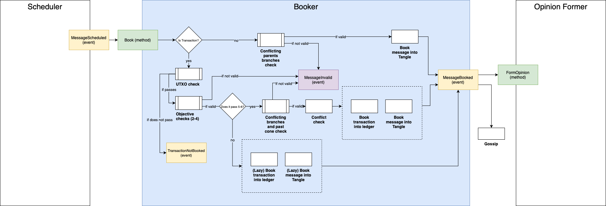

# Components of the Protocol
This section provides a high-level description of the interaction between components of the currently implemented GoShimmer protocol. The protocol can be divided into three main elements: a P2P overlay network, an immutable data structure, and a consensus mechanism. These three elements are abstracted into layers, where, similarly to other architectures, upper layers build on the functionality provided by the layers below them. The definition of the different layers is merely about the convenience of creating a clear separation of concerns.

## Network Layer

The network layer modules maintain the network, which can be characterized as a pure P2P overlay network. This means that it is a system that runs on top of another network (the internet), where all nodes have the same roles and perform the same actions (in contrast to client-server systems). 

GoShimmer's Network Layer consists of three basic modules: 
- The [peer discovery](autopeering.md#peer-discovery) module, which provides a list of nodes actively using the network)
- The [neighbor selection](autopeering.md#neighbor-selection) module (also known as autopeering), which actually selects peers. 
- The P2P Communication manages a node's neighbors, selected by either [autopeering](autopeering.md) or [manual peering](../../tutorials/manual_peering.md).

## Communication Layer

The communication layer consists of the information propagated through the network layer, which is contained in objects called _messages_. This layer forms a directed acyclic graph (DAG) with messages as vertices called the [Tangle](tangle.md). The  [Tangle](tangle.md) is a replicated, shared and distributed data structure that emerges through a combination of deterministic rules, cooperation, and either direct or virtual voting as FPC and approval weight based finality.

Since nodes have finite capabilities, the number of messages that the network can process is limited. The network might become overloaded, either because of honest heavy usage or because of malicious spam attacks. To protect the network from halting, or even from getting inconsistent, the [rate control](../protocol_high_level_overview.md#rate-and-congestion-control) (currently a static PoW) and [congestion control](congestion_control.md) modules control when and how many messages can be gossiped.

## (Decentralized) Application Layer

On top of the [communication layer](#communication-layer) lives the application layer. Anybody can develop applications that run on this layer, and nodes can choose which applications to run. These applications can also be dependent on each other.

There are several core applications that must be run by all nodes, such as the value transfer applications which maintain the [ledger state](UTXO_and_ledgerstate.md) (including  advanced [output types](advanced_outputs.md)), and a quantity called [Mana](mana.md), that serves as a scarce resource in the Sybil protection mechanism.

Additionally, all nodes must run what we call the consensus applications, which regulate timestamps in the messages and resolve conflicts.

The consensus mechanism implemented in GoShimmer is leaderless and consists out of two components:
- The [Fast Probabilistic Consensus (FPC)](consensus_mechanism.md#fpc) provides pre-consensus in form of a binary voting protocol that produces consensus on a bit and uses a [distributed Random Number Generator (dRNG)](consensus_mechanism.md#drng) to be resilient against metastable states.
- The virtual [voting protocol (Approval Weight)](consensus_mechanism.md#approval-weight-aw) provides finality similarly to the longest chain rule in Nakamoto consensus (i.e., the heaviest branch) for branches and messages.

## Data Flow 

### Overview

The diagram below represents the interaction between the different modules in the [event driven](../../implementation_design/event_driven_model.md) protocol. Each blue box represents a _component_ of the [Tangle codebase](https://github.com/iotaledger/goshimmer/tree/develop/packages/tangle). Each _component_ has _events_ that belong to it which are represented by the yellow boxes. Those _events_ will _trigger_ _methods_ which are represented by the green boxes.  _Methods_ can also _trigger_ other methods. This triggering is represented by the arrows in the diagram. Finally, the purple boxes represent events that do not belong to the component that triggered them.

Take the Parser component as an example. The function `ProcessGossipMessage` will _trigger_ the _method_ `Parse`, which is the only entry to the _component_. There are three possible outcomes to the `Parser`: triggering a `ParsingFailed` event, a `MessageRejected` event, or a `MessageParsed` event. In the last case, the _event_ will _trigger_ the `StoreMessage` _method_ (which is the entry to the Storage component). The first two events do not trigger any other component.

This data flow is called the [life cycle of a message](../protocol_high_level_overview.md), which goes from message reception up until acceptance in the Tangle. Notice that any message, either created locally by the node or received from a neighbor needs to pass through the data flow.

### Message Factory

The `IssuePayload` function creates a valid payload which is provided to the `CreateMessage` method, along with a set of parents chosen with the Tip Selection Algorithm. Then, the _Message Factory_ component is responsible for finding a nonce compatible with the PoW requirements defined by the rate control module. Finally, the message is signed. Notice that the message generation should follow the rates imposed by the rate setter, as defined in [rate setting](congestion_control.md#rate-setting).

### Parser

The first step after the arrival of the message to the message inbox is the parsing.  Parsing consists of the following different filtering processes, messages that don't pass these steps will not be stored:

#### Bytes filter

- Recently Seen Bytes: Compares the incoming messages with a pool of recently seen bytes to filter duplicates.
  
- PoW check: Checks if the PoW requirements have been met, currently set to the message hash starting with 22 zeroes.

After the bytes filters have been passed, the received bytes are parsed into a message, the message's [payload](tangle.md#payloads), and are [syntactically validated](tangle.md#syntactical-validation). From this point on, the filters will operate on the message's objects rather than just bytes.

#### Message filter
- Signature check: Checks if the message signature is valid.
- [Timestamp Difference Check for transactions](tangle.md#message-timestamp-vs-transaction-timestamp): Checks if the timestamps of the payload, and the message are consistent with each other.

### Storage

The tangle only stores messages that pass the Parser, along with their metadata. Additionally, it stores new messages as approvers of their parents, a reverse mapping that enables us to walk the Tangle into the future cone of a message.

### Solidifier

[Solidification](tangle.md#Solidification) is the process of requesting missing messages. In this step, the node checks if all the past cone of the message is known. In the case that the node realizes that a message in the past cone is missing, it sends a request to its neighbors asking for that missing message. The node will recursively repeat this process until all of a message's past cone up to the genesis (or snapshot) becomes known to the node.

This way, the protocol enables any node to retrieve the entire message history, even for nodes that have just joined the network.

### Scheduler

The scheduler makes sure that the network as a whole can operate with maximum throughput and minimum delays while providing consistency, fairness (according to aMana), and security. Therefore, it regulates the allowed influx of messages to the network as a [congestion-control mechanism](congestion_control.md).

### Booker.

After scheduling, the message goes to the booker. This step is different for messages that contain a transaction payload and messages that do not contain it.

#### Non-transaction payloads

In the case of a non-transaction payload, booking into the Tangle occurs after the conflicting parents branches validation.  This means, after checking if the parents' branches contain sets of two or more transactions that belong to the same conflict set. If this check is not successful, the node will mark the message as _invalid_, and will not book it.

#### Transaction payloads

In the case of a transaction as payload, initially, the following validations take place:

1. UTXO: Checks if the inputs of the transaction were already booked. 
   
    If the message does not pass this check, the node will not book the message. 
    If it passes the check, it goes to the next block of steps.
   
2. Balances: Checks if the sum of the values of the generated outputs equals the sum of the values of the consumed inputs.   
   
    If the message does not pass this check, the node will mark the message as _invalid_, and _not booked_. 
    If it passes the check, it goes to the next step.
   
3. Unlock conditions: Checks if the unlock conditions are valid. 
   
    If the message does not pass this check, the node will mark the message as _invalid_, and _not booked_. 
    If it passes the check, it goes to the next step.
   
4. Inputs' branches validity: Checks if all the consumed inputs belong to a valid branch. 
   
    If the message does not pass this check, the node will mark the message as _invalid_, and _not booked_. 
    If it passes the check, it goes to the next step.

After the objective validations, the node will perform the following subjective validations:

5. Inputs' branches rejection: Checks if all the consumed inputs belong to a non-rejected branch. Notice that this is not an objective check, so the node is susceptible (even if with a small probability) to have its opinion about rejected branches changed by a reorganization. For that reason, if the message does not pass this check, the message is booked into the Tangle and ledger state (even though the balances are not altered by this message, since it will be booked to a rejected branch). This is called "lazy booking", which is done to avoid huge re-calculations in case of a reorganization of the ledger. If it passes the check, it goes to the next step.
   
6. Double spend check: Checks if any of the inputs is conflicting with a transaction that was already confirmed. 
   
    This check is not objective, and if the message does not pass this check, it is lazy booked into the Tangle and ledger state, into an invalid branch. If it passes the check, it goes to the next step.

At this point, the missing steps are the most computationally expensive:

7.  Inputs' conflicting branches: Checks if the branches of the inputs are conflicting.
   
    If the message does not pass this check, the node will mark the message as _invalid_, and _not booked_. 
    If it passes the check, it goes to the next step.
    
8. Conflict check: it checks if the inputs are conflicting with an unconfirmed transaction. In this step, the branch to which the message belongs is computed. In both cases (passing the check or not), the transaction is booked into the ledger state and the message is booked into the Tangle, but its branch ID will be different depending on the outcome of the check.

Finally, after a message is booked, it can become a [marker](markers.md) (depending on the marker policy) and can be gossiped.

### Consensus Mechanism

Before the node forms a local opinion on a message it will add its weight to its branch and past markers. This way it always keeps track of the [approval weight](consensus_mechanism.md#approval-weight-aw), and an incoming message might trigger the confirmation of branches and/or messages in its past cone.

Afterwards, it forms opinions in two independent processes, that can be done in parallel: the payload opinion setting, and the message timestamp opinion setting. The message timestamp opinion setting is currently not integrated, and we simply like all timestamps.

In parallel to the message timestamp opinion setting, the payload must also be evaluated. If the message does not contain a transaction payload, the payload opinion is automatically set to _liked_. Otherwise, it has to pass the FCoB rule, and possibly an FPC voting, in order to be `liked`, as described in the [consensus mechanism section](consensus_mechanism.md#fpc).

### Tip Manager

The tip manager initially performs the eligibility check (i.e., subjective timestamp if OK).  If this check passes, the messages is considered to be _eligible_ for tip selection.  Otherwise, the message is _not eligible_.

If a message is eligible for [tip selection](tangle.md#tsa), and its payload is `liked`, along with all its weak past cone, the message will be added to the strong tip pool and its parents removed from the strong tip pool. 

If a message is eligible for [tip selection](tangle.md#tsa), its payload is `liked`, but its branch is not liked, it is added to the weak tip pool.
