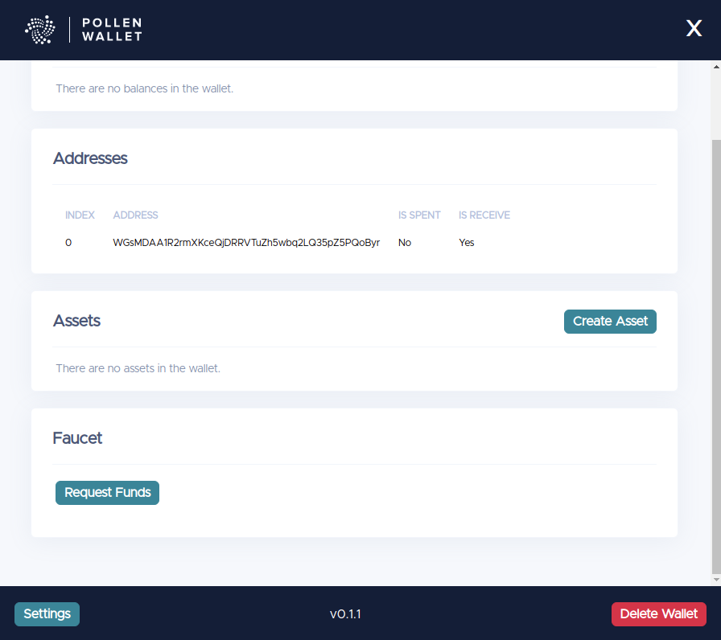

# Obtain Tokens From the Faucet

## The Faucet dApp
The faucet is a dApp built on top of the [value and communication layer](../apis/communication.md). It sends IOTA tokens to addresses by listening to faucet request messages. A faucet message is a _Message_ containing a special payload with an address encoded in Base58, the aManaPledgeID, the cManaPledgeID and a nonce as a proof that some Proof Of Work(PoW) has been computed. The PoW is just a way to rate limit, and avoid abuse of the Faucet. The Faucet has an additional protection by means of granting requests to a given address only once. That means that, in order to receive funds from the Faucet multiple times, the address must be different.

After sending a faucet request message, you can check your balances using the [`GetAddressUnspentOutputs()`](../apis/ledgerstate.md) function.

## Obtain tokens from the faucet

There are 3 ways to send a faucet request message to obtain IOTA tokens:

- [Via the Go client library](#via-the-go-client-library)
- [Via the wallet](#via-the-wallet)
- Via the HTTP API

### Via the Go Client Library
Before proceeding to the example, please follow the instructions in [Use the API](../apis/api.md) to set up the API instance. 

To request funds using the Go client library you either use the `goshimAPI.sendFaucetRequest` function, making sure to provide your: 

* Base58 encoded destination address
* the proof of work difficulty
* the optional Base58 encoded aManaPledgeID
* the optional Base58 encoded cManaPledgeID

```go
// provide your Base58 encoded destination address,
// the proof of work difficulty,
// the optional aManaPledgeID (Base58 encoded),
// the optional cManaPledgeID (Base58 encoded)
messageID, err := goshimAPI.SendFaucetRequest("JaMauTaTSVBNc13edCCvBK9fZxZ1KKW5fXegT1B7N9jY", 22, "2GtxMQD94KvDH1SJPJV7icxofkyV1njuUZKtsqKmtux5", "2GtxMQD94KvDH1SJPJV7icxofkyV1njuUZKtsqKmtux5")
```

Alternatively, you can retrieve the address using from the wallet instance using the `wallet.New(connector).Seed().Address(0)` function.  After retrieving the address, you can use the `goshimAPI.sendFaucetRequest` function to request the funds, providing your:

* The String() of address you retrieved using the `wallet.New(connector).Seed().Address(0)` function. 
* the proof of work difficulty
* the optional Base58 encoded aManaPledgeID
* the optional Base58 encoded cManaPledgeID

```go
// invoke go get github.com/iotaledger/goshimmer/client/wallet for wallet usage
// get the given address from a wallet instance and
connector := wallet.GenericConnector(wallet.NewWebConnector("http://localhost:8080"))
addr := wallet.New(connector).Seed().Address(0)
// use String() to get base58 representation
// the proof of work difficulty,
// the optional aManaPledgeID (Base58 encoded),
// the optional cManaPledgeID (Base58 encoded)
messageID, err := goshimAPI.SendFaucetRequest(addr.String(), 22, "2GtxMQD94KvDH1SJPJV7icxofkyV1njuUZKtsqKmtux5", "2GtxMQD94KvDH1SJPJV7icxofkyV1njuUZKtsqKmtux5")
```

### Via the wallet

Currently, there is one cli-wallet and two GUI wallets you can use.  

#### Cli-wallet

If you want to use the cli-wallet, you can follow the tutorial in the  [Command Line Wallet
](wallet.md#requesting-tokens) section.

#### GUI wallets

You can use the [Pollen wallet](#pollen-wallet) or the [Dr. Electron Electric Shimmer wallet](#dr-electron-electricshimmer-wallet) to request funds.

#### Pollen wallet

The IOTA foundation created the Pollen wallet to interact with the GoShimmer network.  You can find installation instructions in the official [Pollen wallet repository](https://github.com/iotaledger/pollen-wallet/tree/master).

#### Dr-Electron ElectricShimmer wallet

The community member Dr. Electron has created the [Dr-Electron ElectricShimmer](https://github.com/Dr-Electron/ElectricShimmer) wallet.  You can find installation instructions in the repository.

#### Requesting the funds
Once you have set up your GUI wallet, you can request funds by pressing the `Request Funds` in the wallet.



It may take a while to receive the funds:


Once the faucet request is successful, you can check the received balances:

