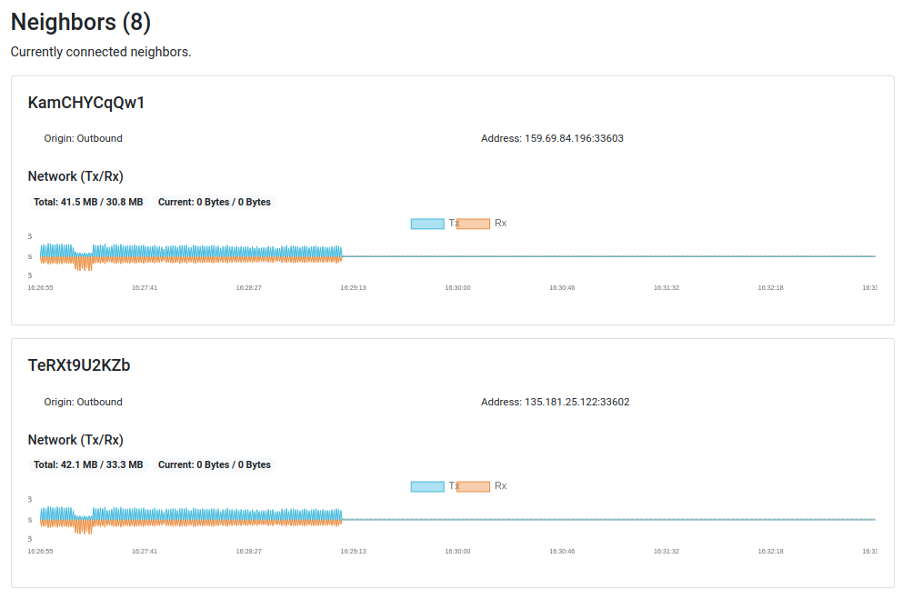

# Setting up a GoShimmer node 

This page describes how to set up your own GoShimmer node in the GoShimmer testnet with Docker.

:::warning
 **There will be breaking changes approximately every two weeks.  These changes will require the entire network to be upgraded. If you don't have time to continuously monitor and upgrade your node, then running a GoShimmer node might not be for you.**  

We want to emphasize that running a GoShimmer node requires proper knowledge in Linux, and IT related topics such as networking. It is not meant as a node to be run by people with little experience in the mentioned fields. 

**Do not plan to run any production level services on your node/network.**
::: 

## Why you should run a node

Running a node in the GoShimmer testnet will help us the following ways:

* It increases the amount of nodes in the network, which lets the network be more realistic.
* Your node will be configured to send debug log messages to a centralized logger from which we can assess and debug research questions, and occurring problems.
* Your node will send metric data to a centralized analysis server where we store information such as resource consumption, traffic, FPC vote context processing and so on. This data helps us foster the development of GoShimmer and assess network behavior.
* If you expose your HTTP API port, you will provide an entrypoint for other people to interact with the network.

:::info
Note that any metric data is anonymous.
:::

## Installing GoShimmer with Docker

### Hardware Requirements

:::info
We do not provide a Docker image or binaries for ARM based systems such as Raspberry Pis.
:::

We recommend running GoShimmer on an x86 VPS with following minimum hardware specs:

* 2 cores / 4 threads
* 4 GB of memory
* 40 GB of disk space

A cheap [CX21 Hetzner instance](https://www.hetzner.de/cloud) is thereby sufficient.

If you plan on running your GoShimmer node from home, please only do so if you know how to properly configure NAT on your router. Otherwise, your node will not correctly participate in the network.


:::info
In the following sections we are going to use a CX21 Hetzner instance with Ubuntu 20.04, logged in as the root user.
:::

Before you continue, please make sure to update and upgrade the packages on our system.  You can do so by running the following command:

```bash
apt update && apt dist-upgrade -y
```

### Install Docker

#### Required dependencies

Before installing Docker you will need to install the following dependencies:

- [apt-transport-https](https://packages.debian.org/jessie/apt-transport-https)
- [ca-certificates](https://packages.debian.org/sid/ca-certificates)
- [curl](https://packages.ubuntu.com/source/bionic/curl)
- [gnupg-agent](https://packages.debian.org/jessie/gnupg-agent)
- [software-properties-common](https://packages.debian.org/sid/admin/software-properties-common)
  
You can run the following command to install them:

```bash 
apt-get install \
     apt-transport-https \
     ca-certificates \
     curl \
     gnupg-agent \
     software-properties-common
```
#### Add Docker's Official GPG Key 

After you have met all the required dependencies, you should add Docker’s official GPG key by running:

```bash
curl -fsSL https://download.docker.com/linux/ubuntu/gpg | apt-key add -
```

You can verify that the GPG key matches by running:

```bash
apt-key fingerprint 0EBFCD88
pub   rsa4096 2017-02-22 [SCEA]
      9DC8 5822 9FC7 DD38 854A  E2D8 8D81 803C 0EBF CD88
uid           [ unknown] Docker Release (CE deb) <docker@docker.com>
sub   rsa4096 2017-02-22 [S]

```
#### Add the Docker repository

After you've verified the GPG key, you should add the actual docker repository:

```bash
add-apt-repository \
   "deb [arch=amd64] https://download.docker.com/linux/ubuntu \
   $(lsb_release -cs) \
   stable"
```

You should update the package index by running:

```bash
apt-get update
```

#### Install Docker

You can now install docker by running the following command:

```bash
apt-get install docker-ce docker-ce-cli containerd.io
```

On windows-subsystem for Linux (WSL2), it may be necessary to start docker separately.  However, this may not work on WSL1.

```bash
/etc/init.d/docker start
```

You check if docker is running by executing `docker ps`:

```bash
docker ps
CONTAINER ID        IMAGE               COMMAND             CREATED             STATUS              PORTS               NAMES
```

### Install Docker Compose

Docker compose gives you the ability to define your services with `docker-compose.yml` files, instead of having to define all container parameters directly on the CLI.

You can download docker compose by running the following command:

```bash
curl -L "https://github.com/docker/compose/releases/download/1.26.0/docker-compose-$(uname -s)-$(uname -m)" -o /usr/local/bin/docker-compose
```

After you have downloaded the installer, you will need to make it executable:

```bash
chmod +x /usr/local/bin/docker-compose
```

You can verify your installation by running `docker-compose --version`, which should provide a similar output to the one below:

```bash
docker-compose --version
docker-compose version 1.26.0, build d4451659
```

### Define the docker-compose.yml File

#### Create a user defined bridged network

Unlike the existing _bridge_ network, a user defined bridged network will have container name DNS resolution for containers within that network. This is useful if later you want to set up additional containers which need to speak with the GoShimmer container.

You can create a user defined bridged network by running the following command:

```bash 
docker network create --driver=bridge shimmer
c726034d295c3df66803b92c71ca517a0cf0e3c65c1c6d84ee5fa34ae76cbcd4
```

You should create a folder holding your `docker-compose.yml` by running the following command:

```bash
mkdir /opt/goshimmer
```

Once you have created the directory for holding your `docker-compose.yml`, you should create a `db` directory, and change its permission to `0777`.  You can do so by running the following commands:

```bash
cd /opt/goshimmer
mkdir db
chmod 0777 db
```

Once you have created the db directory, you can create your `docker-compose.yml` by running the following command:

```bash
nano docker-compose.yml
```

After the `docker-compose.yml` file has been created, you should add the following content to it's body:

```yaml
version: '3.3'

networks:
  outside:
    external:
      name: shimmer

services:
  goshimmer:
    image: iotaledger/goshimmer:latest
    container_name: goshimmer
    hostname: goshimmer
    stop_grace_period: 2m
    volumes:
      - "./db:/tmp/mainnetdb:rw"   
      - "/etc/localtime:/etc/localtime:ro"
    ports:
      # Autopeering 
      - "0.0.0.0:14626:14626/udp"
      # Gossip
      - "0.0.0.0:14666:14666/tcp"
      # FPC
      - "0.0.0.0:10895:10895/tcp"
      # HTTP API
      - "0.0.0.0:8080:8080/tcp"
      # Dashboard
      - "0.0.0.0:8081:8081/tcp"
      # pprof profiling
      - "0.0.0.0:6061:6061/tcp"
    environment:
      - ANALYSIS_CLIENT_SERVERADDRESS=ressims.iota.cafe:21888
      - AUTOPEERING_PORT=14626
      - DASHBOARD_BINDADDRESS=0.0.0.0:8081
      - GOSSIP_PORT=14666
      - WEBAPI_BINDADDRESS=0.0.0.0:8080
      - PROFILING_BINDADDRESS=0.0.0.0:6061
      - NETWORKDELAY_ORIGINPUBLICKEY=9DB3j9cWYSuEEtkvanrzqkzCQMdH1FGv3TawJdVbDxkd
      - FPC_BINDADDRESS=0.0.0.0:10895
      - PROMETHEUS_BINDADDRESS=0.0.0.0:9311
    command: >
      --skip-config=true
      --autopeering.entryNodes=2PV5487xMw5rasGBXXWeqSi4hLz7r19YBt8Y1TGAsQbj@ressims.iota.cafe:15626,5EDH4uY78EA6wrBkHHAVBWBMDt7EcksRq6pjzipoW15B@entry-devnet.tanglebay.com:14646
      --node.disablePlugins=
      --node.enablePlugins=remotelog,networkdelay,spammer,prometheus
      --logger.level=info
      --logger.disableEvents=false
      --logger.remotelog.serverAddress=ressims.iota.cafe:5213
      --drng.pollen.instanceId=1
      --drng.pollen.threshold=3
      --drng.pollen.committeeMembers=AheLpbhRs1XZsRF8t8VBwuyQh9mqPHXQvthV5rsHytDG,FZ28bSTidszUBn8TTCAT9X1nVMwFNnoYBmZ1xfafez2z,GT3UxryW4rA9RN9ojnMGmZgE2wP7psagQxgVdA4B9L1P,4pB5boPvvk2o5MbMySDhqsmC2CtUdXyotPPEpb7YQPD7,64wCsTZpmKjRVHtBKXiFojw7uw3GszumfvC4kHdWsHga
      --drng.xteam.instanceId=1339
      --drng.xteam.threshold=4
      --drng.xteam.committeeMembers=GUdTwLDb6t6vZ7X5XzEnjFNDEVPteU7tVQ9nzKLfPjdo,68vNzBFE9HpmWLb2x4599AUUQNuimuhwn3XahTZZYUHt,Dc9n3JxYecaX3gpxVnWb4jS3KVz1K1SgSK1KpV1dzqT1,75g6r4tqGZhrgpDYZyZxVje1Qo54ezFYkCw94ELTLhPs,CN1XLXLHT9hv7fy3qNhpgNMD6uoHFkHtaNNKyNVCKybf,7SmttyqrKMkLo5NPYaiFoHs8LE6s7oCoWCQaZhui8m16,CypSmrHpTe3WQmCw54KP91F5gTmrQEL7EmTX38YStFXx
    networks:
      - outside
```

:::info
 If performance is a concern, you can also run your containers with `network_mode: "host"`.  However, you must then adjust the hostnames in the configs for the corresponding containers. You may also need to create some _iptable_ rules to block traffic from outside accessing your services directly.
:::

#### NAT Ports

If you have used the provided YML configuration, you will have created the following ports:

| Port  | Functionality  | Protocol |
| ----- | -------------- | -------- |
| 14626 | Autopeering    | UDP      |
| 14666 | Gossip         | TCP      |
| 10895 | FPC            | TCP/HTTP |
| 8080  | HTTP API      | TCP/HTTP |
| 8081  | Dashboard       | TCP/HTTP |
| 6061  | pprof HTTP API | TCP/HTTP |

It is important that you map these ports correctly.  This way the node can, for example, actively participate in FPC votes, or gain inbound neighbors.

:::warning
If you have not configured the UDP NAT mapping correctly, GoShimmer will terminate with an error message stating that you should check the NAT configuration.
:::

## Running the GoShimmer Node

To start your GoShimmer node, you should move to the  `/opt/goshimmer` directory,  where the `docker-compose.yml` resides.  Once you are in the correct directory, you can start your node by running the following command:

```bash
docker-compose up -d
Pulling goshimmer (iotaledger/goshimmer:0.2.0)...
...
```

If you run the `docker ps` command, you should now see your container running:

```bash
CONTAINER ID        IMAGE               COMMAND                  CREATED             STATUS              PORTS                                                                                                                                    NAMES
687f52b78cb5        iotaledger/goshimmer:0.2.0       "/run/goshimmer --sk…"   19 seconds ago      Up 17 seconds       0.0.0.0:6061->6061/tcp, 0.0.0.0:8080-8081->8080-8081/tcp, 0.0.0.0:10895->10895/tcp, 0.0.0.0:14666->14666/tcp, 0.0.0.0:14626->14626/udp   goshimmer
```

You can follow the log output of the node by running:

```bash
docker logs -f --since=1m goshimmer
```

### Syncing

When the node starts for the first time, it must synchronize its state with the rest of the network. GoShimmer currently uses Tangle Time to help nodes determine their synced status, which you can view in your [dashboard](#dashboard)

#### Dashboard

You can access your  GoShimmer dashboard by visiting `http://<your-ip>:8081`. If your node is still synchronizing, you might see a higher inflow of messages per second (MPS).


After a while, your node's dashboard should also display up to 8 neighbors:




#### HTTP API

GoShimmer also exposes an HTTP API. You can access it by visiting `http://<your-ip>:8080/info`.  If your API is healthy, it should return a JSON response in the form of:

```json
{
  "version": "v0.6.2",
  "networkVersion": 30,
  "tangleTime": {
    "messageID": "6ndfmfogpH9H8C9X9Fbb7Jmuf8RJHQgSjsHNPdKUUhoJ",
    "time": 1621879864032595415,
    "synced": true
  },
  "identityID": "D9SPFofAGhA5V9QRDngc1E8qG9bTrnATmpZMdoyRiBoW",
  "identityIDShort": "XBgY5DsUPng",
  "publicKey": "9DB3j9cWYSuEEtkvanrzqkzCQMdH1FGv3TawJdVbDxkd",
  "solidMessageCount": 74088,
  "totalMessageCount": 74088,
  "enabledPlugins": [
    ...
  ],
  "disabledPlugins": [
    ...
  ],
  "mana": {
    "access": 1,
    "accessTimestamp": "2021-05-24T20:11:05.451224937+02:00",
    "consensus": 10439991680906,
    "consensusTimestamp": "2021-05-24T20:11:05.451228137+02:00"
  },
  "manaDelegationAddress": "1HMQic52dz3xLY2aeDXcDhX53LgbsHghdfD8eGXR1qVHy",
  "mana_decay": 0.00003209,
  "scheduler": {
    "running": true,
    "rate": "5ms",
    "nodeQueueSizes": {}
  },
  "rateSetter": {
    "rate": 20000,
    "size": 0
  }
}
```

## Managing the GoShimmer Node Lifecycle

### Stopping the Node

You can stop your GoShimmer node by running the following command:

```bash
docker-compose stop
```

### Resetting the Node

You can reset your GoShimmer node by running the following command:

```bash
docker-compose down
```

### Upgrading the Node

:::info
Before starting your upgrade, please ensure that the image version in the `docker-compose.yml` is set to _latest_.
:::

1. Reset the container:

 ```bash
 docker-compose down
 ```

2. Remove the database directory's files by running from the folder holding your `docker-compose.yml`:

 ```bash
 rm db/*
 ```

3. Pull the latest image version by running: 

 ```bash
 docker-compose pull
 ```

4. Start your updated node by running: 

 ```bash
 docker-compose up -d
 ```

### Following Log Output

You can follow your node's log output by running the following command: 

```bash
docker logs -f --since=1m goshimmer
```

### Output Your Logs to a File

If you wish to output all the node's logs to a file, you can run the following command replacing `log.txt` for your desired output file:

```bash
docker logs goshimmer > log.txt
```


## Setting up the Grafana dashboard

### Add Prometheus and Grafana Containers to docker-compose.yml

If you want to add the Prometheus and Grafana containers you should append the following to the previously described [`docker-compose.yml`](#define-the-docker-composeyml) file.  Please make sure to also respect the two white spaces in front of the _prometheus_ key:

```yaml
  prometheus:
    image: prom/prometheus:latest
    container_name: prometheus
    restart: unless-stopped
    ports:
      - "9090:9090/tcp"
    command:
      - --config.file=/etc/prometheus/prometheus.yml
    volumes:
      - ./prometheus/prometheus.yml:/etc/prometheus/prometheus.yml:ro
      - ./prometheus/data:/prometheus:rw
    depends_on:
      - goshimmer
    networks:
      - outside

  grafana:
    image: grafana/grafana:latest
    container_name: grafana
    restart: unless-stopped
    environment:
      # path to provisioning definitions can only be defined as
      # environment variables for grafana within docker
      - GF_PATHS_PROVISIONING=/var/lib/grafana/provisioning
    ports:
      - "3000:3000/tcp"
    user: "472"
    volumes:
      - ./grafana:/var/lib/grafana:rw
    networks:
      - outside
```
### Create the Prometheus and Grafana configuration files

#### Create Prometheus config

1. Create a `prometheus/data` directory in `/opt/goshimmer`:

```bash
cd /opt/goshimmer
mkdir -p prometheus/data
```

2. Create a `prometheus.yml` in `prometheus` directory:

```bash
nano prometheus/prometheus.yml
```

3. Add the following content to the `prometheus/prometheus.yml` file created in the previous step:

```yaml
scrape_configs:
    - job_name: goshimmer_local
      scrape_interval: 5s
      static_configs:
      - targets:
        - goshimmer:9311
```

4. Change the permissions for `prometheus` config directory:

```bash
chmod -R 777 prometheus
```

#### Create Grafana config

1. Create necessary config directories in `/opt/goshimmer/` by running the following command from `/opt/goshhimer/`:

```bash
mkdir -p grafana/provisioning/datasources grafana/provisioning/dashboards grafana/provisioning/notifiers
mkdir -p grafana/dashboards
```

2. Create a datasource configuration file in `/opt/goshimmer/grafana/provisioning/datasources` by running:

```bash
nano grafana/provisioning/datasources/datasources.yaml
```

3. Add the following content to the datasource.yaml file created in the previous step.

```yaml
apiVersion: 1

datasources:
  - name: Prometheus
    type: prometheus
    # <string, required> access mode. proxy or direct (Server or Browser in the UI). Required
    access: proxy
    orgId: 1
    url: http://prometheus:9090
    jsonData:
      graphiteVersion: '1.1'
      timeInterval: '1s'
    # <string> json object of data that will be encrypted.
    secureJsonData:
      # <string> database password, if used
      password:
      # <string> basic auth password
      basicAuthPassword:
    version: 1
    # <bool> allow users to edit datasources from the UI.
    editable: true
```

4. Create a dashboard configuration file in `opt/goshimmer/grafana/provisioning/dashboards` by running:

```bash
nano grafana/provisioning/dashboards/dashboards.yaml
```

5. Add the following content to the `dashboards.yaml` file created in the previous step:

```yaml
apiVersion: 1

providers:
  - name: 'Goshimmer Local Metrics'
    orgId: 1
    folder: ''
    type: file
    disableDeletion: false
    editable: true
    updateIntervalSeconds: 10
    allowUiUpdates: true
    options:
      path: /var/lib/grafana/dashboards
```

5. Add predefined GoShimmer Local Metrics Dashboard by heading over to the GoShimmer repository, and downloading the [local_dashboard.json file](https://github.com/iotaledger/goshimmer/blob/master/tools/monitoring/grafana/dashboards/local_dashboard.json).  You can do so by running the following command:

```bash
wget https://raw.githubusercontent.com/iotaledger/goshimmer/master/tools/monitoring/grafana/dashboards/local_dashboard.json
cp local_dashboard.json grafana/dashboards
```

6. Change the permissions for Grafana config folder by running:

```bash
chmod -R 777 grafana
```

### Run GoShimmer with Prometheus and Grafana:

Once you have successfully added the [Prometheus and Grafana containers](#add-prometheus-and-grafana-containers-to-docker-composeyml) and [created the configuration files](#create-the-prometheus-and-graphana-configuration-files), you can now start your GoShimmer node with Prometheus and Grafana by running the following command:

```bash
docker-compose up -d
```

You can access the Grafana dashboard by visiting `http://<your-ip>:3000`.

The default login credentials are:

* `username`: admin
* `password`: admin

### Update Grafana Dashboard

Once you have set up the Grafana dashboard for your node according to the [Setting up the Grafana dashboard](#setting-up-the-grafana-dashboard) section, you can update your dashboard at any time by downloading and copying the new [dashboard file](https://github.com/iotaledger/goshimmer/blob/master/tools/monitoring/grafana/dashboards/local_dashboard.json) into `/opt/goshimmer/grafana/dashboards` directory.

Supposing you are at `/opt/goshimmer/`, you can run the following command:

 ```bash
 wget https://raw.githubusercontent.com/iotaledger/goshimmer/master/tools/monitoring/grafana/dashboards/local_dashboard.json
 cp local_dashboard.json grafana/dashboards
 ```

After the download is complete, you should restart the grafana container by running:

```bash
docker restart grafana
```

