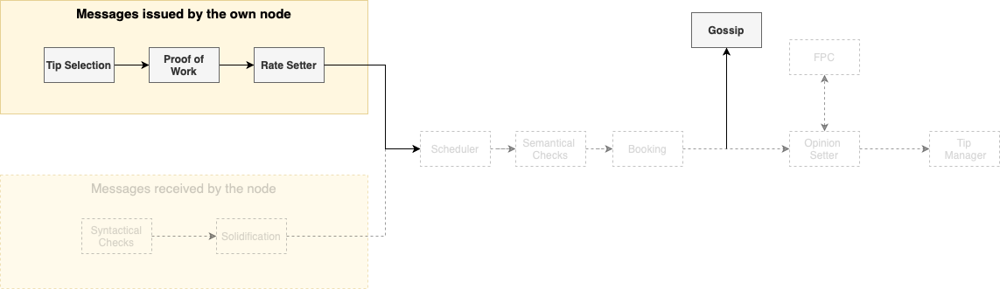
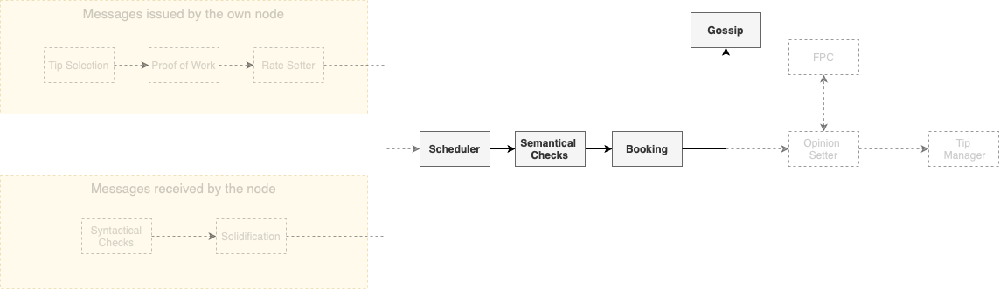
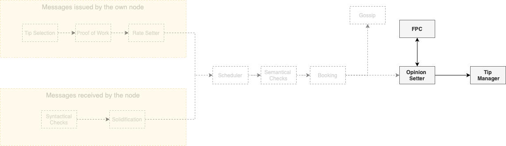

# Protocol high-level overview

To orientate the reader, we provide a high-level overview of the protocol, following the natural life cycle of a message. The first module used&mdash;while the message is still being created&mdash;, is the **Tip Selection**(ADD LINK) module. Here, the node must choose a certain number (from two to eight) of other messages to reference, meaning that the newly created message will be cryptographically attached to these referenced messages. An honest node must always choose tips uniformly at random from a tip pool, i.e., from a set of still unreferenced messages that satisfy a certain set of conditions, as discussed on INSERT LINK. In the diagram below, the issuance process being described now is represented in the context of the complete protocol. 

Each node in the network has limited bandwidth, CPU, and memory. In order to avoid any node from being overloaded, the right to write in everybody else's Tangle is regulated by the **Congestion Control Module**. This module fairly allocates the network resources accordingly to a quantity called **Access Mana**, that acts as a [Sybil protection](https://en.wikipedia.org/wiki/Sybil_attack) mechanism. The exact manner in which Access Mana is acquired is discussed in INSERT LINK. But&mdash;for the purposes of this overview&mdash;we can summarize Access Mana as a scarce resource, that makes an effective Sybil protection mechanism. Thus, each node has the right to issue messages at a rate proportional to their Access Mana. This fair rate is not constant (since the utilization of the network may fluctuate), and to correctly set its own individual rate of issuance of messages, each node uses a mechanism called the **Rate Setter**, that makes the average issuance rate of the node converge to the fair rate guaranteed by Access Mana. Nodes which do not use the rate Setter will be punished by the **Rate Control Module**, which uses **adaptive Proof of Work** to limit the rate an attacker can create messages. Essentially, to issue a message, honest nodes must do a small amount of proof of work. However, if an attacker begins to issue too many messages and floods the network with messages, the difficulty of the proof of work for that node will increase exponentially. Eventually, the attacker will be incapable of issuing new messages.

Between the Rate Setter and the actual gossip of the message, several steps will take place, but&mdash;for the sake of clearness&mdash;we ignore these steps for now and return to this subject later. Then, assuming that the message was properly created, it will be propagated to the rest of the network. Since we deal with a large number of nodes, the communication graph cannot be [complete](https://en.wikipedia.org/wiki/Complete_graph). Thus, the [network topology](https://en.wikipedia.org/wiki/Network_topology) will be dictated by the **Neighbor Selection** (aka Auto-Peering) module, described in INSERT LINK. 

We turn our attention now to another point of view: the one of the nodes receiving new messages, represented in the diagram above. After receiving a message, the node will perform several **syntactical verifications**, that will act like a filter to the messages. Additionally, the message has to be **solidified**, meaning that the node must know all the past cone of the message (i.e., the set of all messages directly or indirectly referenced by the message in question). After this step, the node places all the messages left into an inbox (OUTBOX OR INBOX??). At a fixed global rate (meaning that all nodes use the same rate), the node uses a **scheduler** to choose a message from the inbox. This scheduler works as a gatekeeper, effectively regulating the use of the most scarce resources of the nodes. Since the scheduler works at a fixed rate, the network cannot be overwhelmed. As discussed in INSERT LINK, the scheduler is designed to ensure the following properties:

1. **Consistency**: all honest nodes will schedule the same messages
2. **Fair access**: the nodes' messages will be scheduled at a fair rate according to their Access Mana
4. **Bounded latency**: network delay of all messages will be bounded (????????????)
5. **Security**: the properties above hold even in the presence of an attacker

Only after passing the scheduler the messages can be written into the local Tangle. To do that, the nodes perform most of the **semantic validation**, such as the search for irreconcilable conflicts in the message's past cone or (in the case of value transfers) unlock condition checks. At this point (if the message passes this tests), the message will be **booked** into the **local Tangle** of the node. Additionally, in the case of a value transfer, the **ledger state** and two vectors called Access Mana Vector (already mentioned in this text) and **Consensus Mana** Vector are updated accordingly. The Consensus Mana is another Sybil protection mechanism which&mdash;since it is applied to different modules than Access Mana&mdash;has the need of a different calculation (for more details on that subject, see INSERT LINK). 

After having the message booked, the node is free to **gossip** it, but a crucial step of the protocol is still missing: the **Opinion Setter** and the voting protocol, that deal with the most subjective parts of the consensus mechanism (notice that, until now, the protocol has mostly dealt with objective checks). The voting protocol used here is the FPC (or **Fast Probabilistic Consensus**), which is a binary voting protocol which allows a large group of nodes to come to consensus on the value of a single bit. The FPC begins with each node having an initial opinion, set using the node's local time perception and ordering of the messages. The nodes must set opinions about two subjects: 

1. **The legitimacy of the timestamp of the message**: Whenever a node issues a message, it adds a timestamp to it, which should represent the local time of issuance (as seen by the issuer node). The other nodes will judge if this timestamp is reasonable, by checking if it is too far away from their own local clock. The specific rule to do this check is described in LINK.
2. In the case of a value transfer, **whether it is a conflict**: We use the **FCoB Rule** (ADD LINK). Roughly, the node will have a positive opinion about a transaction A if and only if all its conflicts arrived later than a certain time interval after A's arrival. 

In each round, nodes randomly choose other nodes to query about their opinions about one of the subjects above. The querying node changes its own opinion if the number of responses with a different opinion than it is greater than a certain threshold. In order to prevent liveness attacks, this threshold is determined by a random number issued by a committee of high Consensus Mana nodes via the **dRNG** application. Without the random threshold, an attacker could lie about its responses in a way that could prevent the protocol from terminating. Finally, a node will finalize on a certain opinion after holding it for a certain number of rounds. 

When selecting which other nodes to query, a node must weight the list of all nodes by Consensus Mana. Thus, high Consensus Mana nodes are queried more often than low Consensus Mana nodes. This makes it difficult for an attacker to manipulate the outcome of the voting. Unless the attacker controls more than 1/3 of the Consensus Mana in the system, with high probability, we know that FPC has the following properties:

1. **Termination**: every honest node will finalize on some opinion before a maximum round number.
2. **Agreement**: all honest nodes will finalize on the same opinion.
3. **Integrity**: if a super majority of nodes&mdash;e.g. more than 90% weighted by Consensus Mana&mdash;, have the same initial opinion, then FPC will terminate with that value.

Some concepts or modules implemented&mdash;even not strictly being part of the protocol&mdash;have an extreme importance in the understanding of the protocol as a whole, such as the **Grades of Finality** (add link). Analogously to Bitcoin's [six blocks rule](https://en.bitcoin.it/wiki/Confirmation), our protocol also has certain measures of the probability of a certain message being considered valid permanently by all nodes. The four possible grades are:

1. **Grade 1**: If 10 seconds have passed since the time the message arrived and no conflict was seen.
2. **Grade 2**: If 20 seconds have passed since the time the message arrived and no conflict was seen.
3. **Grade 3**: If the message achieved grade 2 and it accumulated enough approval weight (see LINK for more details)
4. **Grade 4**: If the message achieved grade 3 and 30 minutes (??????????) have passed since the timestamp of the message

For more details on the grades above, see LINK.

