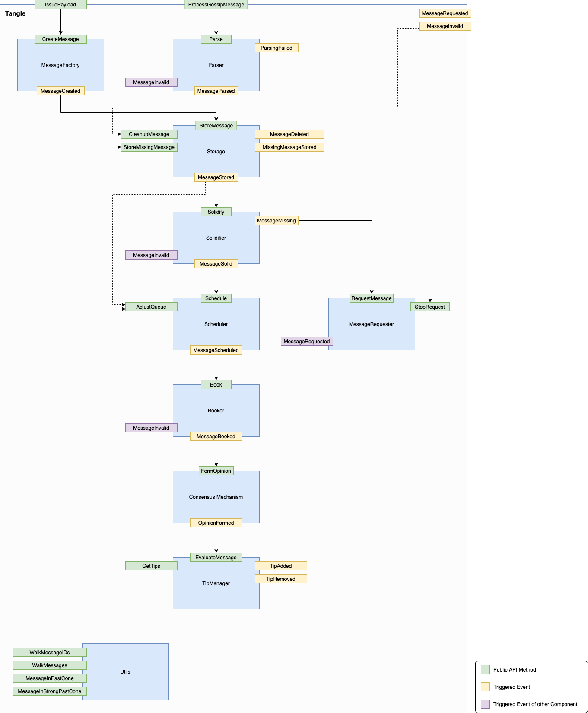

# Components of the Protocol
This section provides a high-level description of the interaction between components of the currently implemented GoShimmer protocol. The protocol can be divided into three main elements: a P2P overlay network, an immutable data structure, and a consensus mechanism. We abstract these three elements into layers, where—similarly to other architectures—upper layers build on the functionality provided by the layers below them. The definition of the different layers is merely about the convenience of creating a clear separation of concerns.


## Network Layer
The network is maintained by the network layer modules, which can be characterized as a pure P2P overlay network, meaning that it is a system that runs on top of another network (e.g., the internet), and where all nodes have the same roles and perform the same actions (in contrast to client-server systems). GoShimmer's Network Layer consists of three basic modules: the [peer discovery](./autopeering.md#peer-discovery) module (which provides a list of nodes actively using the network), and the [neighbor selection](./autopeering.md#neighbor-selection) module (also known as autopeering), which actually select peers. Finally, the P2P Communication manages a node's neighbors, either selected via [autopeering](autopeering.md) or [manual peering](../tutorials/manual_peering.md).

## Communication Layer
The communication layer concerns the information propagated through the network layer, which is contained in objects called messages. This layer forms a DAG with messages as vertices called [The Tangle](./tangle.md): a replicated, shared and distributed data structure that emerges through a combination of deterministic rules, cooperation, and (either direct or virtual) voting—as FPC and approval weight based finality.
Since nodes have finite capabilities, the number of messages that the network can process is limited. Thus, the network might become overloaded, either simply because of honest heavy usage or because of malicious (spam) attacks. To protect the network from halting or even from getting inconsistent, the rate control (currently a static PoW) and [congestion control](./congestion_control.md) modules control when and how many messages can be gossiped.

## (Decentralized) Application Layer
On top of the communication layer lives the application layer. Anybody can develop applications that run on this layer, and nodes can choose which applications to run. Of course, these applications can also be dependent on each other.
There are several core applications that must be run by all nodes, as the value transfer applications, which maintains the [ledger state](./ledgerstate.md) and a quantity called [Mana](./mana.md), that serves as a scarce resource as our Sybil protection mechanism.
Additionally, all nodes must run what we call the consensus applications, which regulate timestamps in the messages and resolve conflicts.
The consensus mechanism implemented in GoShimmer is leaderless and consists out of multiple components:
1. The [Fast Probabilistic Consensus (FPC)](./consensus_mechanism.md#fpc) provides pre-consensus in form of a binary voting protocol that produces consensus on a bit and uses a [distributed Random Number Generator (dRNG)](./consensus_mechanism.md#drng) to be resilient against metastable states.
2. A virtual voting protocol (Approval Weight) that provides finality similarly to the longest chain rule in Nakamoto consensus (i.e., heaviest branch) for branches and messages.


## Data flow - Overview
The diagram below represents the interaction between the different modules in the protocol ([event driven](../implementation_design/event_driven_model.md)). Each blue box represents a component, which has events (in yellow boxes) that belong to it. Those events will trigger methods (the green boxes), that can also trigger other methods. This triggering is represented by the arrows in the diagram. Finally, the purple boxes represent events that do not belong to the component that triggered them.

As an example, take the Parser component. The function `ProcessGossipMessage` will trigger the method `Parse`, which is the only entry to the component. There are three possible outcomes to the `Parser`: triggering a `ParsingFailed` event, a `MessageRejected` event, or a `MessageParsed` event. In the last case, the event will trigger the `StoreMessage` method (which is the entry to the Storage component), whereas the first two events do not trigger any other component.



We call this the data flow, i.e., the life cycle of a message, from message reception (meaning that we focus here on the point of view of a node receiving a message issued by another node) up until acceptance in the Tangle. Notice that any message, either created locally by the node or received from a neighbor needs to pass through the data flow.

### Message Factory
The IssuePayload function creates a valid payload which is provided to the CreateMessage method, along with a set of parents chosen with the Tip Selection Algorithm. Then, the Message Factory component is responsible to find a nonce compatible with the PoW requirements defined by the rate control module. Finally, the message is signed. Notice that the message generation should follow the rates imposed by the rate setter, as defined in [rate setting](./congestion_control.md#rate-setting).

### Parser
The first step after the arrival of the message to the message inbox is the parsing, which consists of the following different filtering processes (meaning that the messages that don't pass these steps will not be stored):

**Bytes filter**:
1. Recently Seen Bytes: it compares the incoming messages with a pool of recently seen bytes to filter duplicates.
2. PoW check: it checks if the PoW requirements are met, currently set to the message hash starting with 22 zeroes.

Followed by the bytes filters, the received bytes are parsed into a message and its corresponding payload and [syntactically validated](./tangle.md#syntactical-validation). From now on, the filters operate on message objects rather than just bytes.

**Message filter**:
1. Signature check: it checks if the message signature is valid.
2. [Timestamp Difference Check for transactions](./tangle.md#message -timestamp-vs-transaction-timestamp): it checks if the timestamps of the payload, and the message are consistent with each other


### Storage
Only messages that pass the Parser are stored, along with their metadata. Additionally, new messages are stored as approvers of their parents, i.e., a reverse mapping that enables us to walk the Tangle into the future cone of a message.

### Solidifier
The solidification is the process of requesting missing messages. In this step, the node checks if all the past cone of the message is known; in the case that the node realizes that a message in the past cone is missing, it will send a request to its neighbors asking for that missing message. This process is recursively repeated until all of a message's past cone up to the genesis (or snapshot) becomes known to the node (for more information, see [Section 4.4 - Solidification](./4.4%20Solidification.md)).
This way, the protocol enables any node to retrieve the entire message history, even for nodes that have just joined the network. When the solidification process successfully ends, the flag `solid` in its metadata is set to `TRUE`. In the case that the process does not terminate successfully, the flag `invalid` is set to `TRUE`. If, while solidifying, the node realizes that one of the parents of the message is `invalid`, the message itself is also marked as `invalid`.

Also in the solidifier, the "Parents age check" is performed. It consists in checking if the timestamp of the message and the timestamps of each of its parents satisfy
```parent.timestamp+DELTA >= message.timestamp >= parent.timestamp``` (see [Section 4.2 - Timestamps](./4.2%20Timestamps.md)). As in the solidification case, if the above condition is not met, the message is marked as `invalid`.


### Scheduler
One may think of the scheduler as a gatekeeper to the more expensive computations. Once the steps above are successful, the message is enqueued into the outbox. The outbox is split into several queues, each one corresponding to a different node issuing messages. Once the message is enqueued into the right place, the queue is sorted by increasing message timestamp. The dequeueing process is done using a modified version of the deficit round robin (DRR) algorithm, as described in [Section 4.6 - Congestion Control](./4.6%20Congestion%20Control.md). A maximum (fixed) global rate `SCHEDULING_RATE`, at which messages will be scheduled, is set.

### 2.3.4.6 Booker
After scheduling, the message goes to the booker. This step is different between messages that contain a transaction payload and messages that do not contain it.

In the case of a non-value message, booking into the Tangle occurs after the conflicting parents branches check, i.e., after checking if the parents' branches contain sets of (two or more) transactions that belong to the same conflict set (see [Section 5.2 - Ledger State](./5.2%20Ledger%20State.md)). In the case of this check not being successful, the message is marked as `invalid` and not booked.

In the case of a value message, initially, the following check is done:

1. UTXO check: it checks if the inputs of the transaction were already booked. If the message does not pass this check, the message is not booked and a `TransactionNotBooked` event is triggered. If it passes the check, it goes to the next block of steps.

Then, the following objective checks are done:

2. Balances check: it checks if the sum of the values of the generated outputs equals the sum of the values of the consumed inputs. If the message does not pass this check, the message is marked as `invalid` and not booked. If it passes the check, it goes to the next step.
3. Unlock conditions: checks if the unlock conditions (see [Section 2.3 - Standard Payloads Layout](./2.2%20Standard%20Payloads%20Layout.md)) are valid. If the message does not pass this check, the message is marked as `invalid` and not booked. If it passes the check, it goes to the next step.
4. Inputs' branches validity check: it checks if all the consumed inputs belong to a valid branch. If the message does not pass this check, the message is marked as `invalid` and not booked. If it passes the check, it goes to the next step.

After the objective checks, the following subjective checks are done:

5. Inputs' branches rejection check: it checks if all the consumed inputs belong to a non-rejected branch. Notice that this is not an objective check, so the node is susceptible (even if with a small probability) to have its opinion about rejected branches changed by a reorganization. For that reason, if the message does not pass this check, the message is booked into the Tangle and ledger state (even though the balances are not altered by this message, since it will be booked to a rejected branch). This is what we call "lazy booking", which is done to avoid huge re-calculations in case of a reorganization of the ledger. If it passes the check, it goes to the next step.
10. Double spend check: it checks if any of the inputs is conflicting with a transaction that was already confirmed. As in the last step, this check is not objective and, thus, if the message does not pass this check, it is lazy booked into the Tangle and ledger state, into an invalid branch. If it passes the check, it goes to the next step.

At this point, the missing steps are the most computationally expensive:

7. Past cone check: it checks if the inputs of the transaction were generated by transactions in the past cone of the message. As this check is objective, if the message does not pass this check, the message is marked as `invalid` and not booked. If it passes the check, it goes to the next step.
8.  Inputs' conflicting branches check: it checks if the branches of the inputs are conflicting. As in the last step, if the message does not pass this check, the message is marked as `invalid` and not booked. If it passes the check, it goes to the next step.
9. Conflict check: it checks if the inputs are conflicting with an unconfirmed transaction. In this step, the branch to which the message belongs is computed. In both cases (passing the check or not), the message is booked into the ledger state and the Tangle, but its branch ID will be different depending on the outcome of the check (see [Section 5.2 - Ledger State](./5.2%20Ledger%20State.md)).


Finally, after a message is booked, it can be gossiped.

### 2.3.4.7 Opinion Former
The opinion former consists of two independent processes, that can be done in parallel: the payload opinion setting and the message timestamp opinion setting. The message timestamp opinion setting is described in [Section 4.2 - Timestamps](./4.2%20Timestamps.md), and it's done after a initial timestamp check (and possible FPC voting, as described in [Section 6.3 - Fast Probabilistic Consensus](./6.3%20Fast%20Probabilistic%20Consensus.md)).

In parallel to the message timestamp opinion setting, a payload evaluation is also done. If the message does not contain a transaction payload, the payload opinion is automatically set to `liked`. Otherwise, it has to pass the FCoB rule (and possibly, an FPC voting) in order to be `liked`, as described in [Section 4.2 - Timestamps](./4.2%20Timestamps.md) and [Section 6.3 - Fast Probabilistic Consensus](./6.3%20Fast%20Probabilistic%20Consensus.md).


### 2.3.4.8 Tip Manager

The first check done in the tip manager is the eligibility check, which is defined in [Section 4.2 - Timestamps](./4.2%20Timestamps.md), after passing it, a message is said to be `eligible` for tip selection (otherwise, it's `not eligible`).  If a message is eligible for tip selection and its payload is `liked`, along with all its weak past cone, the message is added to the strong tip pool and its parents are removed from the strong tip pool (for more information about the different tip pools, see [Section 4.3 - Tip Selection Algorithm](./4.3%20Tip%20Selection%20Algorithm.md)). If a message is eligible for tip selection, its payload is `liked` and the message is not in the strong pool, it is added to the weak tip pool and its parents are removed from any the pool that they are included.

