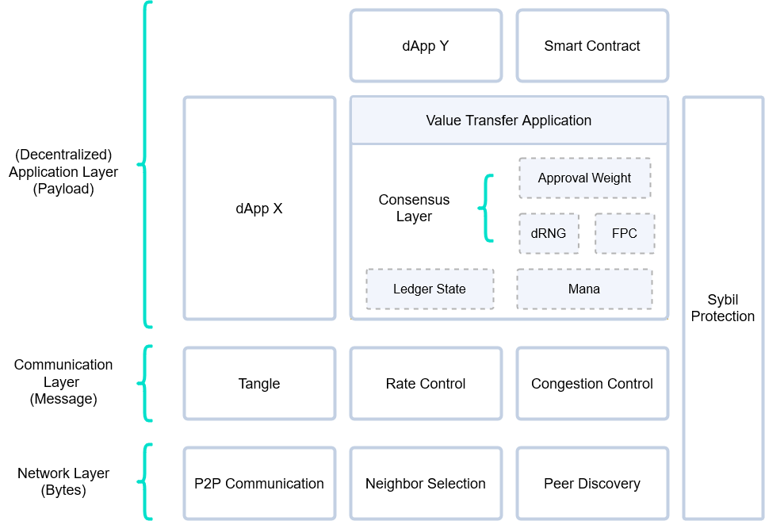

# Layers
> DISCLAIMER: The described layers describe how things are implemented in GoShimmer. They might not reflect final IOTA 2.0 specification or implementations.

GoShimmer abstracts node functionalities into different layers. Similar to other architectures, upper layers build on the provided functionality of the layers below them. A layer is merely the concept of creating a clear separation of concerns.

Within a layer we can have several modules that can be swapped with different implementations while keeping compatibility with the overall protocol.

## Network Layer
The network layer provides all the primitives required to build a network topology and to exchange data across the network.

## Communication Layer
The *communication layer* gives semantic to the data received from the *network layer* in the form of *messages*. It also takes care of regulating the access to the communication medium, specifically, the Tangle.

## (Decentralized) Application Layer
Each *message* contains a *payload* that is used to define multiple (decentralized) applications. The most obvious example is the value transfer application, that uses as a payload a transaction. Thus, this layer allows to build decentralized applications that may or not require consensus on their state.

## Cross-layer
The above description is only a semplification of how GoShimmer is designed. Clearly, some optimizations or even modules of the protocol may require the need to interact with modules outside of their logical layer. For example, we use access and consensus Mana as a Sybil protection mechanism in most of the core components. This makes part of the implementation of the protocol cross-layer.

