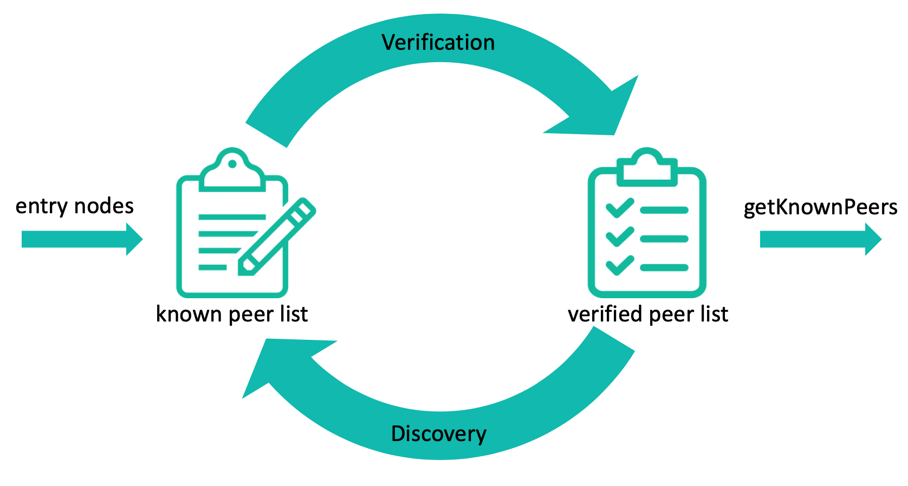

# Autopeering

In order to establish connections, an IOTA node needs to discover and maintain a list of the reachable IP addresses of other peers. Nodes need to be kept up to date about the ledger state, so they exchange information with each other. Each node establishes a communication channel with a small subset of nodes (neighbors) via a process called _peering_. 

This process must be resilient against eclipse attacks: if an attacker controls all of a node’s neighbors, then the attacker has complete control over the node’s view of the Tangle. To prevent and limit sybil-based attacks, the neighbor selection protocol makes use of a scarce resource dubbed _Consensus Mana_. Arbitrary nodes can be created, but it is difficult to produce high mana nodes.

:::info
Throughout this section the terms _Node_ and _Peer_ are used interchangeably to refer to a _Node device_.

The usage of the _Ping_ and _Pong_ mechanisms is to be considered as a bidirectional exchange similarly to that described by other standards such as [CoAP](https://core-wg.github.io/coap-sig/) and [WebSocket](https://tools.ietf.org/html/rfc6455#section-5.5.2).
:::

## Node identities

Every node has a cryptographic identity, a key on the ed25519 elliptic curve. The _blake2b_ hash of the public key of the peer serves as its identifier or _node ID_.

## Peer Discovery

The main goal of the Peer Discovery protocol is to expose an interface providing a list of all the verified peers.

To bootstrap the peer discovery, a node must be able to reach one or more entry nodes. To achieve this, the implementation of the protocol shall provide a hard-coded list of trusted _entry nodes_ run by the IOTA Foundation, or by trusted community members that answer to peer discovery packets coming from new nodes joining the IOTA network. This approach is a common practice of many distributed networks [Neudecker 2018](https://ieeexplore.ieee.org/iel7/9739/8649699/08456488.pdf).

Public Key-based Cryptography (PKC) shall be used for uniquely [identifying](#node-identities) peers and for authenticating each packet.

Ping and Pong protocols are used to verify a peer. A _Ping_ is sent to verify a given peer, and upon reception of a valid _Pong_ as a response from that peer, the peer is verified.

Once a peer has been verified, it can be queried to discover new peers by sending a `DiscoveryRequest`. A `DiscoveryResponse` will be returned as a response, containing a list of new peers. The new peer nodes in this list will also be verified by the receiving application.

The following image summarizes this process, which will be detailed in the following subsections:




### Verification

The verification process aims at both verifying peer identities and checking their online status. Each peer maintains a list of all the known peers(`known_peer_list`). Elements of any known peer list contain a reference to a [Peer](#Peer), and a time at which it will be verified/re-verified.

The `known_peer_list` can be seen as a time-priority queue. A newly discovered peer gets added to the list at the current time. Whenever a peer is verified, its time value on the `known_peer_list` gets updated to the time at which that peer shall be re-verified.

This order aims to allow the node application to verify newly discovered (still unverified) peers first and then to re-verify older peers (confirming their online status) by iterating over the `known_peer_list`.

The order in which the `known_peer_list` is worked through is important. For example, if the peer is added to the front ('head') of the `known_peer_list`, it is possible for an attacker to front-fill the `known_peer_list` with a selection of its own nodes. This is resolved by the use of the time-priority queue.

The verification process always initiates from a _Ping_. Upon reception of a _Ping_, a peer checks its validity by:
* Verifying that the signature of the _Ping_ is valid, and discarding the request otherwise.
* Checking that the _version_ and _network_id_ fields match its configuration, and discarding the Ping otherwise.
* Checking that the `timestamp` field is fresh (not older than a given time), and discarding the packet otherwise;
* Checking that the `dest_addr` matches its IP address, and discarding the _Ping_ otherwise.

Upon successful validation of a received _Ping_, a peer shall respond with a _Pong_. In case the sender of the _Ping_ is a new peer from the perspective of the receiving node, the receiver peer shall add it to its `known_peer_list`. This enables the verification process to also occur in the reverse direction. 

Upon reception of a _Pong_, a peer will check its validity by:

* verifying that the signature of the _Pong_ is valid and discarding it otherwise;
* checking that the `req_hash` field matches a request (i.e. _Ping_) previously sent and not expired (i.e., the difference between the timestamp of the _Ping_ and _Pong_ is not greater than a given threshold) and discarding the associated _Ping_ or _Pong_ otherwise;
* checking that the `dest_addr` matches its IP address and discarding the associated _Ping_ or _Pong_ otherwise.

Upon successful validation of a received _Pong_, a peer will:

* Add the peer sender of the _Pong_ to a list of verified peers called `verified_peer_list`;
* Move the peer entry of the `known_peer_list` to the tail of the list.

### Removal

While verifying a new peer, if no response, or an invalid _Pong_ is received after `max_verify_attempts` attempts, that node will be removed from the `known_peer_list`. Each expected reply should have a timeout so that if no answer is received after that, the attempt is considered concluded, and counted as failed. 

Each peer on the `verified_peer_list` will be re-verified after `verification_lifetime` hours. While re-verifying a peer, if no response, or invalid _Pong_ is received after `max_reverify_attempts` attempts, the peer will be removed from the `verified_peer_list`.

### Discovery

You can use any peer entry of the `verified_peer_list` to discover new peers by sending a `DiscoveryRequest`.

Upon reception of a `DiscoveryRequest`, a peer node will check its validity by:

* Checking that the sender of the `DiscoveryRequest` is a verified peer (stored in the `verified_peer_list`), and discarding the request otherwise.
* Verifying that the signature of the `DiscoveryRequest` is valid, and discarding the request otherwise.
* Checking that the `timestamp` field is fresh (not older than a given time), and discarding the request otherwise.

Upon successful validation of a received `DiscoveryRequest`, a peer will reply with a `DiscoveryResponse`.

Upon reception of a `DiscoveryResponse`, a peer will check its validity by:

* Verifying that the signature of the `DiscoveryResponse` is valid, and discarding the response otherwise;
* Checking that the `req_hash` field matches  previously sent `DiscoveryRequest` which has not expired (the difference between the timestamp of the `DiscoveryRequest` and `DiscoveryResponse` is not greater than a given threshold), and discarding the response otherwise.

Upon successful validation of a received `DiscoveryResponse`, a node adds the nodes contained in the `peers` field to the `known_peer_list`.

## Neighbor Selection

The goal of the neighbor selection is to build a node's neighborhood to be used by the gossip protocol, while preventing attackers from “tricking” other nodes into becoming neighbors. Neighbors are established when one node sends a peering request to another node, which in turn accepts or rejects the request with a peering response. 

To prevent attacks, the protocol makes the peering request _verifiably random_ so that attackers cannot create nodes to which the target node will send requests. The neighbor selection protocol uses both a screening process called _Consensus Mana rank_, and a score function that takes into account some randomness dubbed _private and public salt_.

Half of the neighbors will be constituted from nodes that accepted the peering request, while half will be constituted of nodes that will request for peering. The two distinct groups of neighbors are called:

* Chosen neighbors (outbound): The peers that the node proactively selected through the neighbor selection mechanism.
* Accepted neighbors (inbound): The peers that sent a peering request to the node, and were accepted as a neighbor.

### Local variables

Local variables defined here are included to help in understanding the protocol described in this section. 

 * `saltUpdateInterval`: The time interval at which nodes shall update their salts.
 * `responseTimeout`: The time that node will wait for a response during a peering attempt.
 * `requestExpirationTime`: The time used for the request timestamp validation, if the timestamp is older than this threshold the request will be dropped.
 * `maxPeeringAttempts`: The maximum number of peering requests retries sent to the selected node before the next salt update.

### Mana rank interval

Each peer discovered and verified via the _Peer Discovery_ protocol will have a consensus mana value associated with it. The peer running the _Neighbor Selection_ protocol will keep this information up to date, and use it to update a data structure called `manaRank`. The `manaRank` contains the list of the nodes' identities for each mana value. 

The aim of this ranking is to select a subset of peers having similar mana to the node preparing the ranking. The `potentialNeighbors` are a subset, that is divided into a _lower_ and an _upper_ set with respect to a `targetMana` value (the mana value of the node performing the ranking). 

By iterating over the `manaRank`, each node will fill both the `lower` and  `upper` sets with node identities that have a similar rank to itself. The rank should not be less or greater than a given threshold `rho`, except when each subset does not reach the minimal size `r`.

The following pseudocode describes a reference implementation of this process:

```
Inputs: 
    manaRank: mapping between mana values and the list of nodes' identities with that mana; 
    targetMana: the mana value of the node performing the ranking;
    rho: the ratio determining the length of the rank to consider;
    r: the minimum number of nodes' identities to return for both lower and upper sets;
    Largest(r, targetMana): the set of r largest cMana holders less than targetMana;
    Smallest(r, targetMana): the set of r smallest cMana holders greater than targetMana;

Outputs:
    potentialNeighbors: the set of nodes' identities to consider for neighbor selection;
```

```vbnet
FOR mana IN manaRank
    nodeID = manaRank[mana]
    IF mana > targetMana
        IF mana / targetMana < rho
            Append(upperSet, nodeID)
    ELSE IF mana == 0 || mana == targetMana
        BREAK
    ELSE IF targetMana / mana < rho
        Append(lowerSet, nodeID)

IF Len(lowerSet) < r
	// set lowerSet with the r largest mana holders less than targetMana
	lowerSet = Largest(r, targetMana)
	
IF Len(upperSet) < r
    // set upperSet with the r smallest mana holders greater than targetMana
	upperSet = Smallest(r, targetMana)

potentialNeighbors = Append(upperSet, lowerSet)
RETURN potentialNeighbors

```

### Selection

The maximum number of neighbors is a parameter of the gossip protocol. This section proposes to use a size of 8 neighbors, equally divided into 4 chosen (outbound) and 4 accepted (inbound) neighbors. As the constant number decreases an eclipse probability exponentially, it is crucial to decide on a fixed number of neighbors. The chosen constant is a compromise between having more connections resulting in lower performance, and increased protection from an eclipse attack.

The following are operations involved during neighbor selection process:

1.  Get an up-to-date list of verified and known peers from the _Peer Discovery_ protocol. 
2.  Use [mana rank](#mana-rank-interval) to filter the previous list to obtain a list of peers to be potential neighbors.
3.  Use the score function to request/accept neighbors.

The score between two nodes is measured through the score function *s*, defined by:

`s(nodeID1, nodeID2, salt) = hash(nodeID1 || nodeID2 || salt)`, where:

+ `nodeID1` and `nodeID2` are the identities of the considered nodes.
+ `salt` is the salt value that can be private, or public, depending on the peering direction (inbound/outbound).
+ `hash` is the `blake2b` hash function.
+ ``||`` is the concatenation operation.

Note that the value used as the score is an unsigned integer derived from the first 4 bytes of the byte array after the `hash` function.

In order to connect to new neighbors, each node with ID `ownID` and public salt `pubSalt` keeps a list of potential neighbors derived via [Mana rank](#mana-rank-interval) that is sorted by their score `d(ownID, ·, pubSalt)`. Then, the node shall send peering requests in _ascending order_, containing its own current public salt, and a timestamp representing the issuance time of the request. 

The connecting node will repeat this process until it has established connections to enough neighbors, or it finds closer peers. Those neighbors make up its list of chosen neighbors. The following pseudocode illustrates this process :

```
Inputs: 
    k: desired amount of neighbors; 
    c: current list of chosen neighbors; 
    p: list of potential peers;
    localID: local nodeID 
    pubSalt: local public salt;
```

```vbnet
pSorted = SortByScoreAsc(P, localID, pubSalt)
FOR p IN pSorted
    peeringRequest = SendPeeringRequest(p)
    IF peeringRequest.accepted 
        Append(c, p)
        IF Len(c) == Ceil(k/2) 
            RETURN
```

After sending a peering request a node will:
* Wait to get a `Peering Response`, which could be positive or negative. 
    * If positive: add the peer to its chosen neighbor list.
    * If negative: filter out the peer from future requests until the next salt update, or the process reaches the end of the potential neighbors list.
    * If after `responseTimeout` no response is received, try again for a fixed `maxPeeringAttempts`. If it's not successful, filter out the peer from future requests until the next salt update, or the process reaches the end of the potential neighbors list.
  
In order to accept neighbors, every node with ID `ownID` will generate a private salt `privSalt`.

Upon reception of a *Peering Request*, a peer will make a decision to accept, reject or discard the request by:

* Verifying that the signature of the *Peering Request* is valid, and discarding the request otherwise.
* Checking that the `timestamp` field is valid (not older than a given threshold `requestExpirationTime` specified by the node), and discard the request otherwise.
* Checking that the _mana_ of the requester peer is within the own [Mana rank](#mana-rank-interval), and send back a _negative_ `Peering Response` otherwise.
* Checking that the requester salt matches its hash chain by:
    * Taking the difference between the timestamp of the peering request and the time the initial salt was set, and then dividing this number by `saltUpdateInterval`, rounding down.
    * Hashing the requester public salt as many times as the number of salt changes.
    * Finally, if the result does not match the initial salt, discard the peering request.
* Applying a statistical test to the request defined as `s(remoteID, ownID, ζ_remote) < θ` for a fixed threshold θ, and discard it otherwise. 
    * This test determines the effectiveness of the brute force attack when an attacker tries to establish a connection with a desired peer.
    * With θ set to 0.01, an attacker has only 1% of chance of being successful.
* Accept the peering request by sending back a _positive_ `Peering Response` if either one of the following conditions is satisfied, and send back a _negative_ `Peering Response` otherwise:
    * The current size of the accepted neighbors list is smaller than *Floor(k/2)*. 
    * The score defined as `s(ownID, remoteID, privSalt)` is lower than the current highest score among accepted neighbors. In this case, send a `Peering Drop` to drop the accepted neighbor with the highest score replaced by the requester peer. 

### Neighbor Removal

Neighbor removal can occur for several reasons:
* A node is replacing a neighbor with a better one in terms of score function.
* From the gossip layer, the connection with a neighbor is lost.
* If some form of reputation or bad behavior is being monitored, a neighbor could be dropped in case of misbehavior. For example, a node could respond to the peering request but choose not to gossip received messages.

Independently of the reason, when a peer drops a neighbor will send a `Peering Drop`, and remove the neighbor from its requested/accepted neighbor list. Upon reception of a `Peering Drop`, the peer shall remove the dropping neighbor from its requested/accepted neighbor list.
