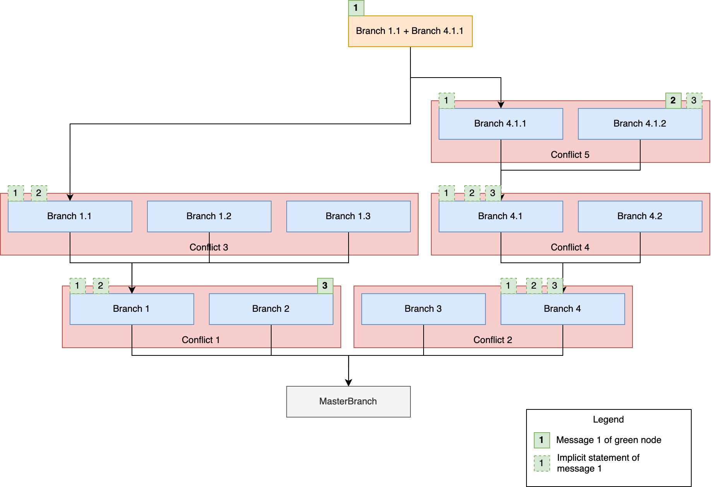

# Consensus Mechanism

The consensus mechanism is necessary to achieve agreement among the nodes of the network. In case of a double spend, one way to decide which transaction should be considered valid would be to order them and pick the oldest one. However, the Tangle is only partially ordered. To tackle this problem in the context of the Tangle, we have designed an open and leaderless consensus mechanism. It combines a binary voting protocol (FPC) used as a pre-consensus to prevent metastable states, and a virtual voting protocol (Approval Weight) that provides finality similarly to the longest chain (heaviest branch) rule in Nakamoto consensus .

## FPC

The [Fast Probabilistic Consensus](https://arxiv.org/abs/1905.10895) (FPC) protocol is a binary voting protocol where each node starts with an initial opinion (a null boolean) on an object.  Nodes then exchange queries and responses about their opinions during several rounds, until each node terminates with a final boolean value.  

FPC votes on two specific objects types: messages, in order to enforce timestamps (currently not yet enabled in GoShimmer), and transactions, in order to decide double spends. Additionally, applications can use FPC to query opinions about their opinion on other object types, although there is no guarantee that they will get a response.  

The FPC is agnostic about the rest of the protocol, particularly when FPC should run, and how the initial opinions are set. Deciding when FPC should run is a delicate question for two reasons:

* It is inefficient for FPC to vote on every single transaction.
* If only a sub set of nodes participate in FPC, they are more vulnerable to attack since the consensus mana held by this collection of nodes is potentially much smaller. Since it cannot vote on everything, it must use subjective criterion to trigger voting which does not leave any group vulnerable to attack.

For these reasons, we use [FCoB](#fcob) to manage FPC.

### FCoB

The following flow diagram shows the current implementation of the FCoB protocol.


Each opinion is associated to a *Level of Knowledge* (LoK) that defines how confident a node is with respect to the value of the opinion. We can distinguish 3 levels:

* _Level 1_ means that the node only knows that it holds this opinion.
* _Level 2_ means that the node knows that all nodes have this opinion too (with high probability).
* _Level 3_ means that the node knows that all nodes have _level 2_ knowledge (with high probability).

Within FCoB, there are three cases which are treated:

1. [No conflicts have been detected](#no-conflicts-have-been-detected)
2. [Conflicts have been detected, but have been rejected](#conflicts-have-been-detected-but-have-been-rejected)
3. [Conflicts have been detected, and are either pending, or have been confirmed](#conflicts-have-been-detected-and-are-either-pending-or-have-been-confirmed)

#### No conflicts have been detected

This the most common because conflicts will never arrive for most transactions. Without conflicts, the opinion can be only set provisionally since it might change if a conflict arrives later. The opinion is set to true, but the level is set as if a conflict arrived at that time.   For example, after a given `Quarantine` time has elapsed since the arrival time, if a conflict does arrive the opinion will remain true with level at least 2.  

#### Conflicts have been detected, but have been rejected

This is an important special case of the FCoB rule. To see the need for this modification consider the following example.  Suppose someone issues a pair of conflicting transactions where both transactions are rejected by FPC. Then, if someone ever issues a new transaction consuming those funds, FCoB, strictly speaking would reject the new transaction, since it would conflict with a previous transaction.  Thus, if a pair of double spends are rejected, the funds would be locked.  This is undesirable and impractical behavior: an honest but malfunctioning wallet can issue double spends.  Moreover, tracking the locked funds would be onerous. 

#### Conflicts have been detected, and are either pending, or have been confirmed

This is the simplest case: since conflicts have been detected, we set the opinion according to the FCOB rule.  Then level is set according to the difference of `transaction.arrivalTime + Quarantine` and `conflictTime`, the oldest arrival time of a conflicting transaction.  Essentially, the level measures how many network delays there are between these two values.   

To prevent the FCoB rule from locking funds, we modify it to the following: a transaction `X` satisfied the FCoB rule if all transactions `Y` conflicting with `X`  before `arrivalTime(X)+Quarantine` have been rejected (opinion false and level 2, or 3).  With this rule, any rejected conflicts will not affect the opinion on future conflicts.  To simplify, all transactions falling under this case will be treated as level 1.

### FPC statements

The FPC protocol requires nodes to directly query randomly selected nodes for conflict resolution. However, the information produced during the voting mechanism is not stored in the Tangle, it only lives within the node's local metadata. This can be a problem for nodes joining the network at a later stage. When a conflict is considered marked as level of knowledge 3 by the majority of the network, a new node cannot query it anymore. 

Since the quorum to query is randomly formed proportionally to cMana, the highest cMana nodes would need to reply to too many queries, as their probability to be included in the quorum of each node is high.

We propose an optimization of the protocol that, in turn, should solve both of the above issues. The idea is to let each node be free to choose whether writing its opinion on a given conflict, and a given FPC round on the Tangle. 

#### Payload

First, we need to define the FPC Statement payload:

 ```go
 type Statement struct {
    ConflictsCount  uint32
 	Conflicts       Conflicts
 	TimestampsCount uint32
 	Timestamps      Timestamps
 }
 type Conflict struct {
 	ID transaction.ID
 	Opinion
 }
 type Timestamp struct {
 	ID tangle.MessageID
 	Opinion
 }
 ```

#### Registry

We also define an Opinion Registry, where nodes can store and keep track of the opinions from each node after parsing FPC Statements.

```go
type Registry struct {
    nodesView map[identity.ID]*View
}
type View struct {
	NodeID     identity.ID
	Conflicts  map[transaction.ID]Opinions
	Timestamps map[tangle.MessageID]Opinions
}
```

Given a nodeID and a ConflictID (or a messageID for timestamps), a node can check if it has the required opinion in its registry. The node can then use that during its FPC round, or if not, send a traditional query to the node.

#### Broadcasting an FPC statement

After forming its opinion for 1 or more conflicts during an FPC round, a node can prepare an FPC statement containing the result of that round, and issue it on the Tangle. Currently, any node that belongs to the top 70% cMana issues FPC statements. This parameter is local to the node and can be changed by the node operator.

## dRNG

At its core, the Fast Probabilistic Consensus (FPC) runs to resolve potential conflicting transactions by voting on them. FPC requires a random number generator (RNG) to be more resilient to an attack aiming at creating a meta-stable state, where nodes in the network are constantly toggling their opinion on a given transaction, and therefore unable to finalize it. Such a RNG can be provided by either a trusted and centralized entity, or it should be decentralized and distributed. Clearly, the fully decentralized nature of IOTA 2.0 mandates the latter option, and this option is referred to a distributed RNG (dRNG).

A dRNG can be implemented in very different ways", for instance by" leveraging on cryptographic primitives such as verifiable secret sharing and threshold signatures, 
by using cryptographic sortition, or with verifiable delay functions.

After reviewing some existing solutions, we decided to use a variant of the [drand](https://github.com/drand/drand) protocol, 
originally developed within the [DEDIS organization](https://github.com/dedis), and as of December 2019, is now under the drand organization.
This protocol has been already used by other projects such as [The League of Entropy](https://www.cloudflare.com/leagueofentropy/).

### Drand - A Distributed Randomness Beacon Daemon

Drand (pronounced "dee-rand") is a distributed randomness beacon daemon written in [Golang](https://golang.org/). Servers running drand can be linked with each other to produce collective, publicly verifiable, unbiased, unpredictable random values at fixed intervals using bi-linear pairings and threshold cryptography. Drand nodes can also serve locally-generated private randomness to clients.

In a nutshell, drand works in two phases: _set up_ and _generation_. 

#### Set up

In the set up phase, a set of nodes (“committee”) run a distributed key generation (DKG) protocol to create a collective private and public key pair shared among the members of the committee. Specifically, at the end of this phase, each member obtains a copy of the public key, as well as a private key share of the collective private key. This way no individual member knows the entire collective private key. These private key shares will then be used by the committee members to sign their contributions during the next phase.

#### Generation

The generation phase works in discrete rounds. In every round, the committee produces a new random value by leveraging on a deterministic threshold signature scheme such as BLS. Each member of the committee createsthe partial BLS signature *σ_r* on the message *m=H(r || ς_r-1)*  in round *r* . Where *ς_r-1* denotes the full BLS threshold signature from the previous round *r−1* and *H* is a cryptographic hash function.

Once at least *t* members have broadcasted their partial signatures *σ_r* on *m*, anyone can recover the full BLS threshold signature *ς_r* (via Lagrange interpolation) which corresponds to the random value of round *r*.

Then, the committee moves to the next round and reiterates the above process. For the first round, each member signs a seed fixed during the setup phase. This process ensures that every new random value depends on all previously generated signatures. 

If you are interested in knowing more about drand, we recommend you to check out their [Github repository](https://github.com/drand/drand).

## Approval Weight (AW)

Similar to the longest chain rule in Nakamoto consensus, approval weight represents the [weight](#active-consensus-mana) of branches (and messages). However, instead of selecting a leader based on a puzzle (PoW), or stake (PoS), it allows every node to express its opinion by simply issuing any message and attaching it in a part of the Tangle it _likes_ (based on FCoB/FPC). This process is also known as virtual voting, and has been previously described in [On Tangle Voting](https://medium.com/@hans_94488/a-new-consensus-the-tangle-multiverse-part-1-da4cb2a69772). 

If a node realizes its opinion according to FCoB/FPC differs from that of the majority of weight, it has to do a reorganization of its perception according to the heaviest branch. This way, all nodes will eventually converge to the heaviest branches, and, come to consensus efficiently. 

AW also serves as a probabilistic finality tool for individual messages and their payloads (transactions).

### Finalization

Finality must always be considered as a probabilistic finality in the sense that a message is included in the ledger with a very high probability. Two desired qualities from a finality criteria are _fast confirmation rate_ and a _high probability of non-reversibility_. 

A branch is considered finalized/confirmed if one of the following holds:

* It is the _MasterBranch_.
* Its approval weight is at least _0.5_ higher than any of its conflicting branches. 

A message is considered finalized/confirmed if its approval weight is higher than _0.5_, and its branch is confirmed.

Conversely, a message that does not gather enough approval weight will not be _finalized_. It will be _pending_, and if it is not reachable by the current tips anymore, it will become orphaned.

### Detailed Design

Approval weight is tracked with the help of supporters that cast votes for branches and messages by means of making statements. This is necessary due to the changing nature of cMana over time, which prevents simply counting the AW per branch or message. 

#### Definitions

* Statement: A statement is any message issued by a _node_, expressing its opinion and casting a virtual vote. It can be objectively ordered by its timestamp, and, if equal, its message ID.
* Branch supporter: A branch supporter is a _node_ that issued a statement attaching to a branch, and voting for it.
* Marker/message supporter: A marker/message's supporter is a _node_ that issued a statement directly, or indirectly referencing a marker/message, including its issuer.

#### Branches

Tracking supporters of branches and following the heaviest branch effectively is _On Tangle Voting_. It allows nodes to express their opinion simply by attaching a statement to a branch they like. This statement needs to propagate down the branch's directed acyclic graph, adding support to each of the branch parents. In case a supporter changes their opinion, support needs to be revoked from all conflicting branches and their children. Therefore, a node can only support one branch of a conflict set. 

To make this more clear consider the following example:



The green node issued **statement 1**, and attached it to the aggregated branch `Branch 1.1 + Branch 4.1.1`. This makes the green node a supporter of all the aggregated branch's parent branches, which are (from top to bottom) `Branch 4.1.1`, `Branch 1.1`, `Branch 4.1`, `Branch 1`, and `Branch 4`.

Then, the green node issued **statement 2**, and attached it to `Branch 4.1.2`. This makes the green node a supporter of `Branch 4.1.2`, however, `Branch 4.1.1` is its conflict branch, and thus support for `Branch 4.1.1` has to be revoked.

`Branch 4.1` and `Branch 4` are parent branches of `Branch 4.1.2`, which the green node is still supporting. Since `Branch 1.1` and `Branch 1` are not conflicting to either of `Branch 4.1.2`'s parents, the green node remains their supporter.

Finally, the green nodes issued **statement 3**, which is in `Branch 2`. Now the green node is a supporter of `Branch 2`, and no longer a supporter of `Branch 1`, since `Branch 1` is conflicting to `Branch 2`. This supporter removal will propagate to child branches. Thus, the green node is removed from `Branch 1.1` as well. Since `Branch 3` and `4`, and both of their child branches, have nothing to do with this attachement, the supporter status remains.

It is important to notice that the arrival order of the statements does not make a difference on the final outcome. Due to the fact that statements can be ordered objectively, every node in the network eventually comes to the same conclusion as to who is supporting which branch, even when nodes change their opinion.


##### Calculation of approval weight

The approval weight (AW) itself is calculated every time a new supporter is added to a branch. The AW for a branch *B* is calculated as follows:

```
AW(B) = supporters(B) dot 'active cMana nodes' / 'total active cMana'
```

It is then evaluated if it fulfills the [finalization](#finalization) criterion. If so, the branch is set to _confirmed_, while all its conflicts are set to _rejected_.

* Reorg: In case the node confirmed another branch of the conflict set first, for example, because of a difference in perception of the ledger state, it will have to do reorg. This means, the node needs to adjust its perception of the ledger state, so that, eventually, all nodes converge and follow the heaviest branch by active cMana.

#### Markers

It would be computationally expensive to track the AW for each message individually. Instead, we approximate the AW with the help of [markers](markers.md). Once a marker fulfills the [finalization](#finalization) criterion, the confirmation is propagated into its past cone until all the messages are confirmed.

Rather than keeping a list of supporters for each marker, and collecting supporters for each marker (which would also be expensive), we keep a list of supporters along with its approved marker index for each marker sequence. This approach provides a simple and fast look-up for marker supporters making use of the Tangle structure as mapped by the markers.

For each marker sequence, we keep a map of supporter to marker index, meaning a supporter supports a marker index `i`. This implies that the supporter supports all markers with index `<= i`.

Take the figure below as an example:


The purple circles represent markers of the same sequence, the numbers are marker indices.

Four nodes (A to D) issue statements with past markers of the purple sequence. Node A and D issue messages having past marker with index 6, so node A and D are the supporters of marker 6 and all markers before, which is 1 to 5. On the other hand, node B issues a message having past marker with index 3, which implies node B is a supporter for marker 1 and 2 as well.

This is a fast look-up and avoids walking through a marker's future cone when it comes to retrieving supporters for approval weight calculation.

For example, to find all supporter of marker 2, you can iterate through the map and filter out those support marker with `index >= 2`. In this case, all nodes are its supporters. As for marker 5, it has supporters node A and D, which fulfill the check: `index >= 5`.

Here is another more complicated example with parent sequences:


The supporter will be propagated to the parent sequence.

Node A issues message A2 having past markers `[1,4], [3,5]`, which implies node A is a supporter for markers `[1,1]` to `[1,4]`, `[2,1]` to `[2,3]`, and `[3,4], [3,5]` as well.

##### Calculation of Approval Weight

The approval weight (AW) itself is calculated every time a new supporter is added to a marker, and the marker's branch *B* has reached its finality criterion. The AW for a marker *M* is calculated as follows:

```
AW(M) = supporters(B) dot supporters(M) dot 'active cMana nodes' / 'total active cMana'
```

It is then evaluated whether it fulfills the [finalization](#finalization) criterion. If so, the marker's message is set to _confirmed_ as well as all messages in its past cone.


## Active Consensus Mana

It is important to track the currently _active_ consensus mana in the system, so that the AW of a given message and/or branch reflects an up to date measure of cumulative weight. Specifically, the system must be resilient against a long-range attack.

The active consensus mana tracks the set of the active nodes with some consensus mana. A node is considered to be _active_ if it has issued any message in the last 30 minutes with respect to the TangleTime. The total active consensus mana is, therefore, the sum of all the consensus mana of each active node.  