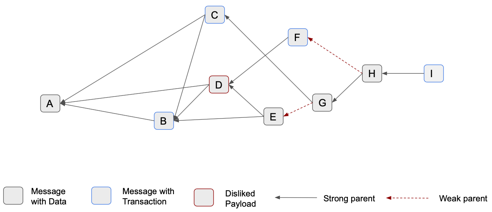
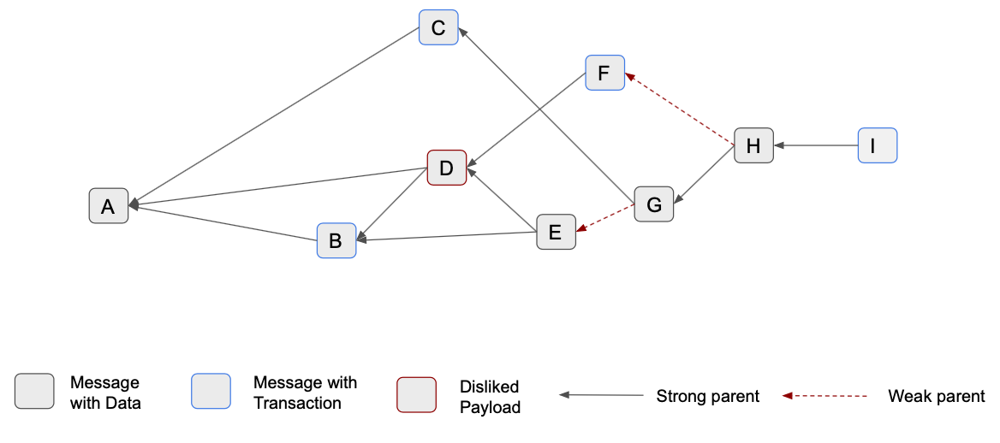
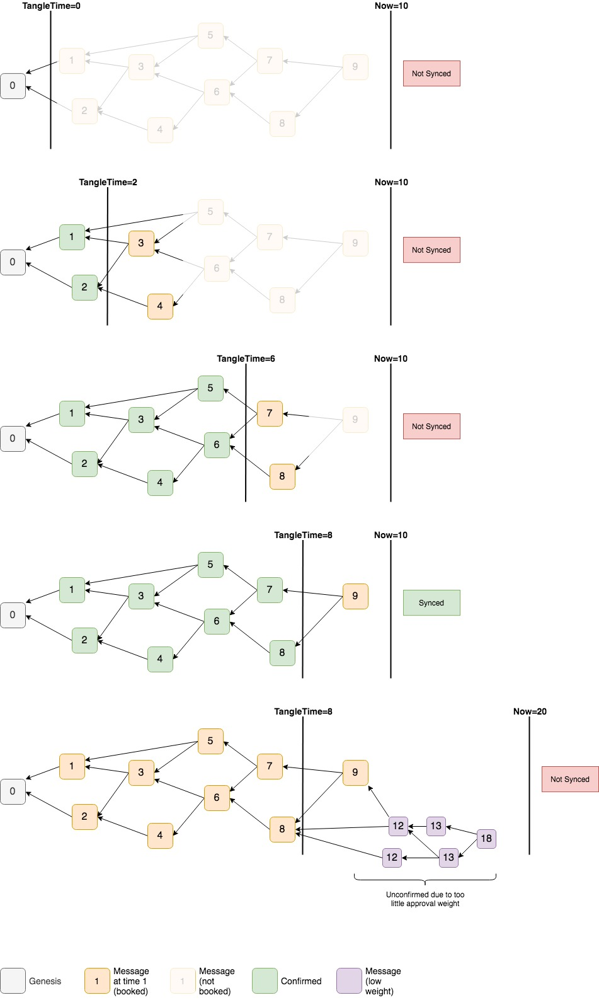

# Tangle

## Data Types

| Name         | Description                                                                                                    |
| ------------ | -------------------------------------------------------------------------------------------------------------- |
| uint8        | An unsigned 8 bit integer encoded in Little Endian.                                                            |
| uint16       | An unsigned 16 bit integer encoded in Little Endian.                                                           |
| uint32       | An unsigned 32 bit integer encoded in Little Endian.                                                           |
| uint64       | An unsigned 64 bit integer encoded in Little Endian.                                                           |
| ByteArray[N] | A static size array of size N.                                                                                 |
| ByteArray    | A dynamically sized array. A uint32 denotes its length.                                                        |
| string       | A dynamically sized array of an UTF-8 encoded string. A uint16 denotes its length.                             |
| time         | Unix time in nanoseconds stored as `int64`, i.e., the number of nanoseconds elapsed since January 1, 1970 UTC. |

## Subschema Notation

| Name           | Description                                               |
| :------------- | :-------------------------------------------------------- |
| oneOf          | One of the listed subschemas.                             |
| optOneOf       | Optionally one of the listed subschemas.                  |
| anyOf          | Any (one or more) of the listed subschemas.               |
| `between(x,y)` | Between (but including) x and y of the listed subschemas. |

## Parameters

- `MAX_MESSAGE_SIZE=64 KB` The maximum allowed message size.
- `MAX_PAYLOAD_SIZE=65157 B` The maximum allowed payload size.
- `MIN_STRONG_PARENTS=1` The minimum amount of strong parents a message needs to reference.
- `MAX_PARENTS=8` The maximum amount of parents a message can reference.

## General concept


The Tangle represents a growing partially-ordered set of messages, linked with each other through cryptographic primitives, and replicated to all nodes in the peer-to-peer network. The Tangle enables the ledger state (i.e., the UTXO-DAG formed by transactions contained in messages), and the possibility to store data.

### Terminology

- Genesis: The genesis message is used to bootstrap the Tangle, and it creates the entire token supply (no other tokens will ever be created). It is the first message and does not have parents. It is marked as _solid_, _eligible_ and _confirmed_.
- Past cone: All messages that are directly or indirectly referenced by a message.
- Future cone: All messages that directly or indirectly reference a message.
- Solidity: A message is marked as solid if its entire past cone until the Genesis (or the latest snapshot) is known.
- Parents: A message directly references between 1-8 previous messages that we call its _parents_. A parent can be either _strong_ or _weak_ (see [approval switch](#orphanage--approval-switch)).
- Approvers: Parents are approved by their referencing messages called _approvers_. It is a reverse mapping of parents. As in the parents' definition, an approver might be either _strong_ or _weak_.
- Branch: A version of the ledger that temporarily coexists with other versions, each spawned by conflicting transactions. 

## Messages

Nodes create and sign messages. Next to several fields of metadata, they carry a _payload_. The maximum message size is `MAX_MESSAGE_SIZE`.

### Message ID

BLAKE2b-256 hash of the byte contents of the message. It should be used by the nodes to index the messages and by external APIs.

### Message Structure

| Name                        | Type                                | Description                                                                                                                                                                                                                    |
| --------------------------- | ----------------------------------- | ------------------------------------------------------------------------------------------------------------------------------------------------------------------------------------------------------------------------------ |
| Version                     | uint8                               | The message version. The schema specified in this RFC is for version 1 only.                                                                                                                                                   |
| Parents count               | uint8                               | The amount of parents preceding the current message.                                                                                                                                                                           |
| Parents type                | uint8                               | Bitwise encoding of parent type matching the order of preceding parents starting at least significant bit. 1 indicates a strong parent, while 0 signals a weak parent. At least MIN_STRONG_PARENTS parent type must be strong. |
| Parents between(1,8)        | [Parent](#parent)                   | Parents, ordered by hash ASC                                                                                                                                                                                                   |
| Issuer public key (Ed25519) | ByteArray[32]                       | The public key of the node issuing the message.                                                                                                                                                                                |
| Issuing time                | time                                | The time the message was issued.                                                                                                                                                                                               |
| Sequence number             | uint64                              | The always increasing number of issued messages of the issuing node.                                                                                                                                                           |
| Payload length              | uint32                              | The length of the Payload. Since its type may be unknown to the node, it must be declared in advance. 0 length means no payload will be attached.                                                                              |
| Payload                     | [Generic Payload](#generic-payload) | An outline of a general payload                                                                                                                                                                                                |
| Nonce                       | uint64                              | The nonce which lets this message fulfill the adaptive Proof-of-Work requirement.                                                                                                                                              |
| Signature (Ed25519)         | ByteArray[64]                       | Signature of the issuing node's private key signing the entire message bytes.                                                                                                                                                  |


#### Parent

| Name   | Type          | Description                           |
| ------ | ------------- | ------------------------------------- |
| Parent | ByteArray[32] | The Message ID of the parent Message. |


#### Generic Payload

| Name         | Type   | Description                                                                                                                                                                |
| ------------ | ------ | -------------------------------------------------------------------------------------------------------------------------------------------------------------------------- |
| Payload Type | uint32 | The type of the payload. It will instruct the node how to parse the fields that follow. Types in the range of 0-127 are "core types", that all nodes are expected to know. |
| Data Fields  | ANY    | A sequence of fields, where the structure depends on payload type.                                                                                                         |

            
### Syntactical Validation

A node will discard messages that do not pass the Syntactical Validation . Only syntactically valid messages continue to the Semantic Validation.

A message is syntactically valid if:

1. The message length does not exceed `MAX_MESSAGE_SIZE` bytes.
2. When the message parsing is complete, there are not any trailing bytes left that were not parsed.
4. It has at least 1, and at most 8, distinct parents ordered in ascending manner, and at least `MIN_STRONG_PARENTS` are strong parents.

### Semantic Validation

A node will discard messages that do not pass the Semantic Validation. Only semantically valid messages continue in the data flow.

A message is semantically valid if:

1. The Message PoW Hash contains at least the number of leading 0 defined as required by the PoW.
2. The signature of the issuing node is valid.
3. It passes [parents age checks](#age-of-parents).


## Payloads

Payloads can contain arbitrary data up to `MAX_PAYLOAD_SIZE`. This allows building additional protocols on top of the base protocol, in the same way as TCP/IP allows to define additional protocols on top of its generic data segment.

Payloads can recursively contain other payloads. This enables the creation of higher level protocols based on the same concepts of layers, as in traditional software and network architecture.

Payloads other than transactions are always liked with level of knowledge 3.

### User-defined payloads

A node can choose to interpret user-defined payloads by listenting to its specific _payload type_ (possibly via third-party code/software). If a node does not know a certain _payload type_, it simply treats it as arbitrary data.

### Core payloads

The core protocol defines a number of payloads that every node needs to interpret and process in order to participate in the network.

- Transactions: Value transfers that constitute the ledger state.
- Data:  Pure data payloads allow to send unsigned messages.
- dRNG: Messages that contain randomness or committee declarations.
- FPC: Opinions on conflicts of transactions and timestamps of the messages, mainly issued by high mana nodes.


## Solidification

Due to the asynchronicity of the network, we may receive messages for which their past cone is not known yet. We refer to these messages as _unsolid_ messages. It is not possible to approve or to gossip _unsolid_ messages. The actions required to obtain the missing messages is called _solidification_.

_Solidification_ is the process of requesting missing referenced messages. It may be recursively repeated until all of a message's past cone up to the genesis (or snapshot) becomes solid.

In that way, the Tangle enables all nodes to retrieve all of a message's history, even the ones joining the network at a point later in time.

### Definitions

* Valid: A message that passes the following filters from the solidifier, and from the message booker:
    * Solidifier: Checks if parents are valid.
    * Booker: Checks if the contained transaction is valid. This check will only be performed on messages containing a transaction.
  
* Parents age check: Ensures the timestamps of parents and child are valid, following the details defined in the [Timestamp specification](#age-of-parents).
* Solid: A message is solid if it passes parents age check, and all its parents are stored, solid and valid.

### Detailed Design

During solidification, if a node is missing a referenced message, the corresponding message ID will be stored in the _solidification buffer_. A node asks its neighbors for the missing message by sending a _solidification request_ containing the message ID. Once the node received the requested message from its neighbors, its message ID will be removed from the _solidification buffer_. If the requested message passes the standard solidification checks, the node will mark it as _solid_. If any of the checks fails, the message remains _unsolid_.

If a message gets solid, it shall walk through the rest of the data flow.  It will then propagate the solid status to its future cone by performing the solidification checks on each of the messages in its future cone again.


## Orphanage & Approval Switch

The Tangle builds approval of a given message by directly or indirectly attaching other messages in its future cone. Due to different reasons, such as the TSA not picking up a given message before its timestamp is still *fresh* or because its past cone has been rejected, a message can become orphan. This implies that the message cannot be included in the Tangle history since all the recent tips do not contain it in their past cone and thus, it cannot be retrieved during solidification. As a result, it might happen that honest messages and transactions would need to be reissued or reattached.
To overcome this limitation, we propose the `approval switch`. The idea is to minimize honest messages along with transactions getting orphaned, by assigning a different meaning to the parents of a message.

### Detailed design

Each message can express two levels of approval with respect to its parents:
* Strong: it defines approval for both the referenced message and with its entire past cone.
* Weak: it defines approval for the referenced message, but not for its past cone.

Consider the following example:



Message *D* contains a transaction that has been rejected, due to the monotonicity rule, so its future cone must be orphaned. Both messages *F* (transaction) and *E* (data) directly reference *D*, and they should not be considered for tip selection. However, by introducing the approval switch, these messages can be picked up via a _weak_ reference as messages *G* and *H* show.

There are two categories of eligible messages:
* Strong message:
    * It is eligible.
    * Its payload is _liked_ with level of knowledge >=2.
    * Its branch is _liked_ with level of knowledge >= 2.
* Weak message:
    * It is eligible.
    * Its payload is _liked_ with level of knowledge >=2.
    * Its branch is _not liked_ with level of knowledge >= 2.

Any strong message *y* approving *x* via a strong reference is _strong approver of x_ (or _strong child of x_). Similarly,  any strong message *y* approving *x* via a weak reference is a _weak approver of x_ (or _weak child of x_).

### TSA

There are two separate tip types:

* Strong tip:
  * It is a strong message
  * It is not directly referenced by any strong message via strong parent

* Weak tip:
  * It is a weak message
  * It is not directly referenced by any strong message via weak parent

Consequently, a node keeps track of the tips by using two distinct tips sets:
* Strong tips set: contains the strong tips
* Weak tips set: contains the weak tips

Tips of both sets must be managed according to the local perception of the node. A strong tip loses its tip status if it gets referenced (via strong parent) by a strong message. Similarly, a weak tip loses its tip status if it gets referenced (via weak parent) by a strong message. This means that weak messages approving via either strong or weak parents, do not have an impact on the tip status of the messages they reference.

### Branch management

A message inherits the branch of its strong parents, while it does not inherit the branch of its weak parents.

#### Approval weight

The approval weight of a given message takes into account all of its future cone built over all its strong approvers.

Consider the following example:



*E* is a weak message strongly approving *B* and *D*. When considering the approval weight of *B*, only the strong approvers *D, E, F* of its future cone are used. The approval weight of *E* would instead be built over *G, H, I*. Therefore, its approval weight does not add up to its own weight (for instance, when looking at the approval weight of *B*).

### Solidification

The solidification process does not change, both parent types are used to progress.

### Test cases

* message *x* strongly approves a strong message *y*: ok.
* message *x* weakly approves a strong message *y*: it's weird, counts for approval weight of *y* but does not affect the tip status of *y*.
* message *x* strongly approves a weak message *y*: *x* becomes a weak message.
* message *x* weakly approves a weak message *y*: ok.


## Finality

Users need to know if their information will not be orphaned. However, finality is inherently probabilistic. For instance, consider the following scenario: an attacker can trivially maintain a chain of messages that do not approve any other message. At any given point in time, it is possible that all messages will be orphaned except this chain. This is incredibly unlikely, but still possible.

Therefore, we introduce [Approval Weight](consensus_mechanism.md#approval-weight-aw)(AW) to measure the finality of any given message. Similarly to Bitcoin's 6 block rule, AW describes how deeply buried a message in the Tangle is. If a message reaches >50% of active consensus mana approving it (its future cone contains messages of nodes that together assert >50% of active consensus mana) it as finalized and, therefore confirmed. Specifically, GoShimmer uses [markers](markers.md) to optimize AW calculations, and approximate AW instead of tracking it for each message individually.

## Timestamps

In order to enable snapshotting based on time constraints, rather than special messages in the Tangle ( checkpoints), nodes need to share the same perception of time. Specifically, they need to have consensus on the _age of messages_. This is one of the reasons that messages must contain a `timestamp` field which represents the message's creation time, and is signed by the issuing node.

Having consensus on the creation time of messages enables not only total ordering, but also new applications that require certain guarantees regarding time. Specifically, Goshimmer uses the message timestamps to enforce timestamps in transactions, which may also be used in computing the Mana associated to a particular node ID.

In this document, we propose a mechanism to achieve consensus on message timestamps by combining a synchronous and an asynchronous approach. While online nodes may leverage FPC to vote on timestamps, nodes that join the network at a later time use an approach based on the [approval weight](#approval-weight) to determine the validity of timestamps.

### Clock Synchronization

Nodes need to share a reasonably similar perception of time in order to effectively judge the accuracy of timestamps. Therefore, we propose that nodes synchronize their clock on startup and resynchronize periodically every 30 minutes to counter [drift](https://en.wikipedia.org/wiki/Clock_drift) of local clocks. Instead of changing a nodes' system clock, we introduce an `offset` parameter to adjust for differences between _network time_ and _local time_ of a node. Initially, the [Network Time Protocol (NTP)](https://en.wikipedia.org/wiki/Network_Time_Protocol) ([Go implementation](https://github.com/beevik/ntp)) is used to achieve this task.

### General Timestamp Rules

Every message contains a timestamp, which is signed by the issuing node. The timestamp itself is objective and immutable. Furthermore, transactions also contain a timestamp, which is also signed by the sender of the transaction (user) and therefore immutable.

In order for a message to be eligible for tip selection, the timestamp of every message in its past cone (both weak and strong) must satisfy certain requirements. These requirements fall into two categories: objective and subjective. 

The objective criteria only depend on information written directly in the Tangle and are applied immediately upon solidification.  All nodes immediately have consensus on the objective criteria.  

The quality of the timestamp is a subjective criterion since it is based on the solidification time of the message.  Nodes must use a consensus algorithm, FPC for example, to decide which messages should be rejected based on subjective criteria. However, this feature is not currently implemented in GoShimmer, and we assume all timestamps to be good.

### Age of Parents

It is problematic when incoming messages reference extremely old messages. If any new message may reference any message in the Tangle, then a node will need to keep all messages readily available, precluding snapshotting. For this reason, we require that the difference between the timestamp of a message, and the timestamp of its parents must be at most 30 minutes. Additionally, we require that timestamps are monotonic, which means parents must have a smaller timestamp than their children's timestamps.


### Message Timestamp vs Transaction Timestamp

Transactions contain a timestamp that is signed by the user when creating the transaction. It is different from the timestamp in the message which is created and signed by the node. We require that: `transaction.timestamp+TW >= message.timestamp >= transaction.timestamp`, where `TW` defines the maximum allowed difference between both timestamps, currently set to 10 minutes.

If a node receives a transaction from a user with an invalid timestamp it does not create a message, it discards the transaction with a corresponding error message to the user. To prevent a user's local clock differences from causing issues, the node should offer an API endpoint to retrieve its `SyncedTime` according to the network time.

### Reattachments

Reattachments of a transaction are possible during the time window (TW). Specifically, a transaction may be reattached in a new message as long as the condition `message.timestamp-TW >= transaction.timestamp` is fulfilled. If for some reason a transaction is not _picked up_ even after reattachment, and it's therefore being orphaned, the user needs to create a new transaction with a current timestamp.

### Age of UTXO

Inputs to a transaction (unspent outputs) inherit their spent time from the transaction timestamp. Similarly, unspent outputs inherit their creation time from the transaction timestamp as well. For a transaction to be considered valid we require `transaction.timestamp >= inputs.timestamp`.

In other words, all inputs to a transaction need to have a smaller or equal timestamp than the transaction. In turn, all created unspent outputs will have a greater or equal timestamp than all inputs.

## Tangle Time

For a variety of reasons, a node needs to be able to determine if it is in sync with the rest of the network, including the following:
- Signal to clients that its perception is healthy.
- Know when to issue messages: Nodes out of sync should not issue messages, unless they are added to the wrong part of the Tangle.
- Schedule messages at the correct rate: Out of sync nodes should schedule faster in order to catch up with the network.
- Optimize FPC: Nodes should not query while syncing, but instead rely on the approval weight.

Every DLT is a clock, or more specifically a network of synchronized clocks. This clock has a natural correspondence with "real time". If the DLT clock differs significantly from local time, then we can conclude that our DLT clock is off from all the other clocks, and the node is out of sync.

_Tangle time_ is the timestamp of t**he last confirmed message. It cannot be attacked without controlling enough mana to accept incorrect timestamps, making it a reliable, attack-resistant quantity.

Typically speaking, `CurrentTime - TangleTime` is, on average, the  approximate confirmation time of messages.  Thus, if this difference is too far off, then we can conclude that we do not know which messages are confirmed, and  we are therefore out of sync.  In this spirit, we are able to define the following function.

```go
func Synced() bool {
  if CurrentTime - TangleTime <= SYNC_THRESHOLD {
    return true
  }
  
  return false
}
```

The following figure displays the Tangle Time:


