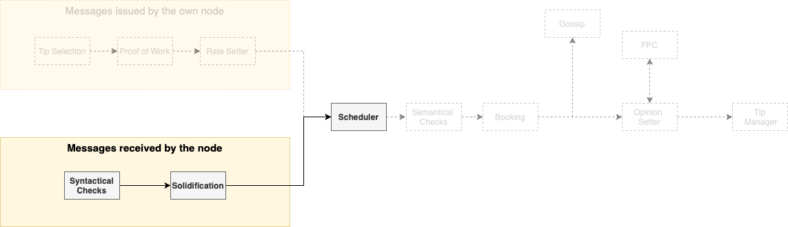

# Protocol high-level overview

## Message Life Cycle

### Tip Selection

The following high-level overview of the protocol will follow the natural life cycle of a message. The first module used while the message is still being created is the _Tip Selection module_.

In the _Tip Selection module_, the node must choose a certain number (from two to eight) of other messages to reference.  This means that the newly created message will be cryptographically attached to these referenced messages.

An honest node must always choose tips uniformly at random from a tip pool (a set of still unreferenced messages that satisfy a certain set of conditions) as discussed on the [Tangle](components/tangle.md) component.

The diagram below represents the issuance process in the context of the complete protocol.

### Rate and Congestion Control

Each node in the network has limited bandwidth, CPU, and memory. In order to avoid any node from being overloaded,the _Rate and Congestion Control modules_ regulates the right to write in everybody else's Tangle.

The _Rate Control module_  dictates the maximum rate of issuance of messages introducing of a small amount of proof of work. 

However, if an attacker accelerates the message issuance, effectively flooding the network, the difficulty of the proof of work for that node will increase exponentially. Eventually, the attacker will be incapable of issuing new messages. 

The _Congestion control module_  will fairly allocate the network resources accordingly to a quantity called _Access Mana_, which acts as a [Sybil protection](https://en.wikipedia.org/wiki/Sybil_attack) mechanism.

In a nutshell, _Access Mana_ is a scarce resource that makes an effective Sybil protection mechanism. Therefore, each node has the right to issue messages at a rate proportional to their Access Mana. 

Since the utilization of the network may fluctuate, this fair rate is not constant.  To correctly set its own individual rate of message issuance, each node uses a mechanism called _Rate Setter_.  The _Rate Setter_ that makes the average issuance rate of the node converge to the fair rate guaranteed by _Access Mana_.

Nodes that do not use the _Rate Setter_ will be punished by either the _Rate Control_, or the _Congestion Control Module_.

Several steps will take place between the _Rate Setter_ and the actual gossiping of the message, but for the sake of clearness these will be ignored for now. 

Assuming that the message was properly created, it will be propagated to the rest of the network. Since we deal with a large number of nodes, the communication graph cannot be [complete](https://en.wikipedia.org/wiki/Complete_graph). 

Therefore, the [network topology](https://en.wikipedia.org/wiki/Network_topology) will be dictated by the [Neighbor Selection (Autopeering)](components/autopeering.md) module. 

### Booking a Message to the Tangle

The diagram shown below illustrates the verification, solidification and scheduling processes the node undertakes when receiving a message.

 
The node will perform several _syntactical verifications_ that will act as a filter to incoming messages. Additionally, the message has to be _solidified_,  meaning that the node must know all the past cone of the message.  This means the node must know the set of all messages which were directly or indirectly referenced by the message. 

After this step, the node places all the messages which passed the verification process into an inbox. At a fixed global rate (meaning that all nodes use the same rate), the node uses a _scheduler_ to choose a message from the inbox. 

This _scheduler_ that, technically, is part of the aforementioned _congestion control_ mechanism-works as a gatekeeper, effectively regulating the use of the most scarce resources of the nodes. 

Since the scheduler works at a fixed rate, the network cannot be overwhelmed.  Even in the presence of attackers, the scheduler is designed to ensure the following properties:

- Consistency: All honest nodes will schedule the same messages.
- Fair access: The nodes' messages will be scheduled at a fair rate according to their Access Mana.
- Bounded latency: The processing time of all messages will be bounded.

Only after passing the scheduler the messages can be written into the local Tangle. To do that, the nodes perform most of the _semantic validation_.  The semantic validation can include the search for irreconcilable conflicts in the message's past cone, or in the case of value transfers unlock condition checks.

If the message passes these checks, the message will be _booked_ into the _local Tangle_ of the node, and be gossiped to the rest of the network.

Additionally, in the case of a value transfer, the _ledger state_ and two vectors called _Access Mana Vector_ and _Consensus Mana Vector_ are updated accordingly.

_The Consensus Mana_ is another Sybil protection mechanism which, since it is applied to different modules than _Access Mana_, has the need of a different calculation. 

### Voting a Message

After [booking the message](#booking-a-message-to-the-tangle), the node is free to _gossip_ it, but a crucial step of the protocol is still missing: the _Opinion Setter_ and the voting protocol, that deal with the most subjective parts of the consensus mechanism (notice that, until now, the protocol has mostly dealt with objective checks). 

Nodes use the  _Fast Probabilistic Consensus_(FPC) voting protocol.  The FPC voting protocol allows a large group of nodes to come to a consensus on the value of a single bit. 

The FPC begins with each node having an initial opinion, set using the node's local time perception, and ordering of the messages. The nodes must set opinions about two subjects: 

1. The legitimacy of the timestamp of the message: Whenever a node issues a message, it adds a timestamp to it, which should represent the local time of issuance (as seen by the issuer node). The other nodes will judge if this timestamp is reasonable by checking if it is too far away from their own local clock.
2. In the case of a value transfer, _whether it is a conflict_: We use the [_FCoB Rule_](components/consensus_mechanism.md#fcob). Roughly, the node will have a positive opinion about a transaction A if and only if all its conflicts arrived later than a certain time interval after A's arrival. 

In each round, nodes randomly choose other nodes to query about their opinions about one of the subjects above. The querying node changes its own opinion if the number of responses with a different opinion than it is greater than a certain threshold. 

In order to prevent liveness attacks, this threshold is determined by a random number issued by a committee of high Consensus Mana nodes via the _dRNG_ application. Without the random threshold, an attacker could lie about its responses in a way that could prevent the protocol from terminating. A node will finalize on an opinion after holding it for a certain number of rounds. 

When selecting which other nodes to query, a node must weight the list of all nodes by _Consensus Mana_.  High _Consensus Mana_ nodes will be queried more often than low _Consensus Mana_ nodes. This makes it difficult for an attacker to manipulate the outcome of the voting process.

Unless the attacker controls more than 1/3 of the _Consensus Mana_ in the system, with high probability, we know that FPC has the following properties:

- Termination: Every honest node will finalize on some opinion before a maximum round number.
- Agreement: All honest nodes will finalize on the same opinion.
- Integrity: If a super majority of nodes, for example more than 90% weighted by Consensus Mana, have the same initial opinion, then FPC will terminate with that value.

Analogously to Bitcoin's [six blocks rule](https://en.bitcoin.it/wiki/Confirmation), our protocol has certain measures of the probability of a certain message being considered valid permanently by all nodes.

This is achieved by the use of the [Approval Weight](components/consensus_mechanism.md#approval-weight-aw). The Approval weight represents the _weight_ of branches and their messages.

Unlike the classical Nakamoto consensus, instead of selecting a leader based on a puzzle (PoW) or stake (PoS), it allows every node to express its opinion by simply issuing any message, and attaching it in a part of the Tangle it likes based on FCoB/FPC.

This process is also known as virtual voting, and has been previously described in [On Tangle Voting](https://medium.com/@hans_94488/a-new-consensus-the-tangle-multiverse-part-1-da4cb2a69772). 
