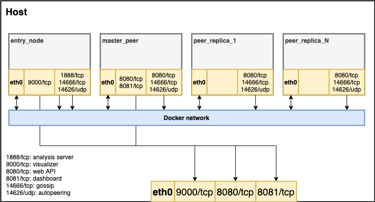

# Docker private network

We provide a tool at `tools/docker-network` with which a local test network can be set up locally with docker. 
 



## How to use the tool

In the docker network run for example
```shell
./run.sh 5 1 1
```

The command `./run.sh` spins up a GoShimmer network within Docker as schematically shown in the figure above. The first integer input defines the number of `peer_replicas` `N`. The second argument is optional for activating the Grafana dashboard, where 
* default (no argument) or 0: Grafana disabled
* 1: Grafana enabled

More details on how to set up the dashboard can be found [here](../tutorials/setup.md).

The third argument is optional for activating a dRNG committee, where
* default (no argument) or 0: dRNG disabled
* 1: dRNG enabled

The peers can communicate freely within the Docker network 
while the analysis and visualizer dashboard, as well as the `master_peer's` dashboard and web API are reachable from the host system on the respective ports.

The settings for the different containers (`entry_node`, `peer_master`, `peer_replica`) can be modified in `docker-compose.yml`.

## How to use as development tool
Using a standalone throwaway Docker network can be really helpful as a development tool. 

Prerequisites: 
- Docker 17.12.0+
- Docker compose: file format 3.5

Reachable from the host system
- analysis dashboard (autopeering visualizer): http://localhost:9000
- `master_peer's` dashboard: http: http://localhost:8081
- `master_peer's` web API: http: http://localhost:8080

It is therefore possible to send messages to the local network via the `master_peer`. Log messages of a specific containter can be followed via 
```
docker logs --follow CONTAINERNAME
```

## Snapshot tool
A snapshot tool is provided in the tools folder. The snapshot file that is created must be moved into the `integration-tests/assets` folder. There, rename and replace the existing bin file (`7R1itJx5hVuo9w9hjg5cwKFmek4HMSoBDgJZN8hKGxih.bin`). After restarting the docker network the snapshot file will be loaded.

## How to use message approval check tool

`get_approval_csv.sh` script helps you conveniently trigger the message approval checks on all nodes in the docker
network, and gather their results in the `csv` folder.

Once the network is up and running, execute the script:
```
./get_approval_csv.sh
```
Example output:
```
Triggering approval analysis on peer_master and 20 replicas...
Triggering approval analysis on peer_master and 20 replicas... DONE
Copying csv files from peer_master and 20 replicas...
Copying csv files from peer_master and 20 replicas... DONE
Copied files are located at ./csv
```
The exported csv files are timestamped to the date of request.
```
csv
├── 210120_16_34_14-docker-network_peer_replica_10.csv
├── 210120_16_34_14-docker-network_peer_replica_11.csv
├── 210120_16_34_14-docker-network_peer_replica_12.csv
...
```
Note, that the record length of the files might differ, since the approval check execution time of the nodes might differ.

## Spammer tool

The Spammer tool lets you add messages to the tangle when running GoShimmer in a Docker network.
In order to start the spammer, you need to send GET requests to a `/spammer` API endpoint with the following parameters:
* `cmd` - one of two possible values: `start` and `stop`.
* `mpm` - messages per minute. Only applicable when `cmd=start`. 
* `imif` - (*optional*) parameter indicating time interval between issued messages. Possible values:
    * `poisson` - emit messages modeled with Poisson point process, whose time intervals are exponential variables with mean 1/rate
    * `uniform` - issues messages at constant rate

Example requests:

```bash
http://localhost:8080/spammer?cmd=start&mpm=1000

http://localhost:8080/spammer?cmd=start&mpm=1000&imif=uniform
http://localhost:8080/spammer?cmd=stop
```

## Tangle width

When running GoShimmer locally in a Docker network, the network delay is so small that only 1 tip will be available most of the time. 
In order to artificially create a tangle structure with multiple tips you can add a `messageLayer.tangleWidth` property to [config.docker.json](https://github.com/iotaledger/goshimmer/blob/develop/tools/docker-network/config.docker.json)
that specifies the number of tips that nodes should retain. This setting exists only for local testing purposes and should not be used in a distributed testnet.  

Here is an example config that can be added: 

```json
  {
  "messageLayer": {
    "tangleWidth": 10
  }}
```