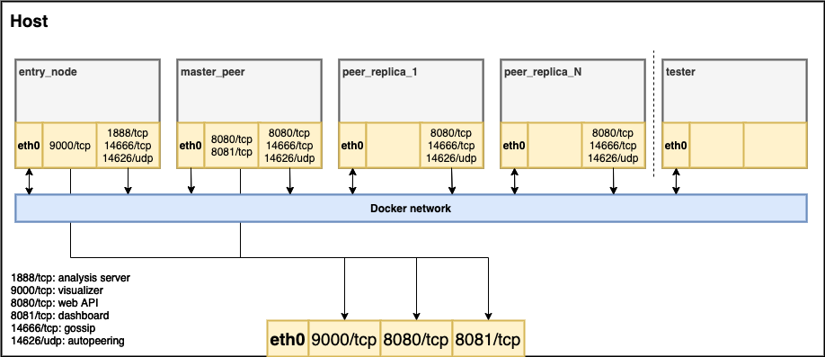

# Integration tests with Docker



Running the integration tests spins up a GoShimmer network within Docker as schematically shown in the figure above.
`N` defines the number of `peer_replicas` and can be specified when running the network.
The peers can communicate freely within the Docker network and this is exactly how the tests are run using the `tester` container.
Test can be written in regular Go style while the framework provides convenience functions to access a specific peer's web API or logs.

The visualizer, `master_peer's` dashboard and web API are reachable from the host system on the respective ports.

The different containers (`entry_node`, `peer_master`, `peer_replica`) load separate config files that can be modified as necessary, respectively. 

## How to run
Prerequisites: 
- Docker
- Docker compose

```
# Mac & Linux
./runTests.sh
```
The tests produce `*.log` files for every peer in the `logs` folder after every run.

Currently, the integration tests are configured to run on every push to GitHub with `peer_replica=5`. 
The logs of every peer are stored as artifacts and can be downloaded for closer inspection once the job finishes.

## Creating tests
Tests can be written in regular Go style. Each tested component should reside in its own test file in `tester/tests`.
`main_test` with its `TestMain` function is executed before any test in the package and initializes the integration test framework.


## Use as development tool
Using a standalone throwaway Docker network can be really helpful as a development tool as well. 

Reachable from the host system
- visualizer: http://localhost:9000
- `master_peer's` dashboard: http: http://localhost:8081
- `master_peer's` web API: http: http://localhost:8080

It is therefore possible to send messages to the local network via the `master_peer` and observe log messages either 
via `docker logs --follow CONTAINER` or by starting the Docker network without the `-d` option, as follows.

```
docker-compose -f docker-compose.yml up --scale peer_replica=5

# 1. test manually with master_peer

# 2. or run in separate terminal window
docker-compose -f tester/docker-compose.yml up --exit-code-from tester
```
Sometimes when changing files, either in the tests or in GoShimmer, Docker does not detect the changes on a rebuild. 
Then the option `--build` needs to be used with `docker-compose`.